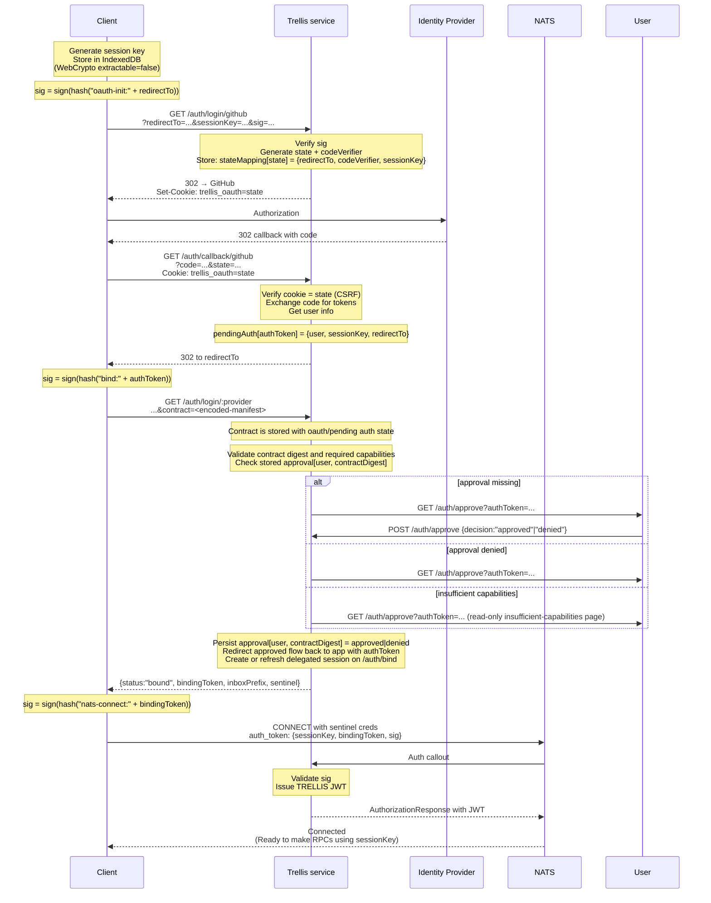

# ADR: Role-Based Authentication and Authorization

## Status

Proposed

## Prerequisites

This ADR assumes familiarity with:

- [adr-trellis-patterns.md](./adr-trellis-patterns.md) — Defines `Result`, `BaseError`, TypeBox schemas, and service and library patterns
- [adr-trellis-contracts-catalog.md](./adr-trellis-contracts-catalog.md) — Contract authoring, runtime catalog, and dynamic permission derivation

## Cryptographic Primitives

| Notation    | Definition                              |
| ----------- | --------------------------------------- |
| `hash(x)`   | SHA-256 digest of x                     |
| `sign(k,x)` | Ed25519 signature of x using key k      |
| Encoding    | base64url without padding (RFC 4648 §5) |

**Canonical byte encoding for signatures:**

| Value type      | Encoding                                                                   |
| --------------- | -------------------------------------------------------------------------- |
| Strings         | UTF-8 bytes via `TextEncoder`                                              |
| Numbers (`iat`) | ASCII decimal string (e.g., `"1735689600"`)                                |
| Concatenation   | `sign(hash("prefix:" + value))` means UTF-8 bytes of literal concatenation |

All Trellis clients, including Rust implementations such as the `trellis` CLI, must match this encoding exactly.

**Identity encoding:**

All identity references use a hashed identifier to prevent delimiter injection:

```typescript
trellisId = base64url(SHA256(origin + ":" + id)).slice(0, 22); // ~132 bits
```

**URL signing:** The signed value is the exact UTF-8 bytes of the URL string as transmitted. No normalization is applied.

## Context

This system authenticates clients via a unified flow:

1. **Bind identity to session key** — via external IdP (users) or admin install (services)
2. **Connect** — NATS connection with sentinel credentials triggers the `trellis` service's auth callout
3. **Auth callout** — the `trellis` service validates the session signature and issues a scoped NATS JWT

Authentication operates at two separate layers:

| Layer               | Mechanism                               | Purpose                                           |
| ------------------- | --------------------------------------- | ------------------------------------------------- |
| NATS transport      | Trellis auth callout with server-generated nKey | Connection-level identity and pub/sub permissions |
| Trellis application | Session key (Ed25519) signatures        | Application identity proofs and role-based access |

### NATS nKey vs Trellis Session Key

| Aspect          | NATS nKey                    | Trellis Session Key               |
| --------------- | ---------------------------- | --------------------------------- |
| Controller      | NATS server (per-connection) | Client (persistent)               |
| Purpose         | Transport authentication     | Application identity proofs       |
| Lifetime        | Single connection            | Across connections                |
| Browser storage | N/A                          | IndexedDB via WebCrypto           |
| Used for        | Pub/sub permissions          | Signing auth proofs, RPC messages |

This separation matters: NATS handles transport identity; Trellis session keys handle application identity. They are independent.

In this ADR, the physical runtime service is named `trellis`. That service hosts `/auth/*`, the NATS auth callout, and the logical contracts `trellis.core@v1` and `trellis.auth@v1`. The auth contract remains logically separate so deployments can split it into another process later if needed.

## Decision

### Principle

Prove session key ownership before granting access. Users and services follow the same core flow — only the identity binding mechanism differs.

For normal authenticated clients, session-key proof alone is not enough. The client must also present a contract during login, and Trellis must have a stored approval for the exact `user <-> contractDigest` pair before `/auth/bind` is allowed to create or refresh the session.

### Identity Providers

| Client Type | Identity Source                  | Binding Mechanism                             |
| ----------- | -------------------------------- | --------------------------------------------- |
| Users       | External IdP (OAuth, OIDC, SAML) | IdP flow binds user ID to session key         |
| Services    | Trellis service registry         | Admin install binds service public key to session key |

The identity source is pluggable. Services can use OAuth — they need only bind an identity to a session key before connecting.

### Session Key Protection

Clients MUST protect the session key private seed from application code.

**Browser clients:**

| Property    | Value                               |
| ----------- | ----------------------------------- |
| Algorithm   | Ed25519                             |
| Storage     | IndexedDB via WebCrypto             |
| Extractable | No (`extractable=false`)            |
| Purpose     | Sign auth_token, RPC message proofs |

WebCrypto's `extractable=false` prevents XSS from stealing the key. Note: this prevents _theft_, not _use_ — XSS can still call `crypto.subtle.sign()` while active.

**Server/Deno clients:**

| Property  | Value                                             |
| --------- | ------------------------------------------------- |
| Algorithm | Ed25519                                           |
| Storage   | Environment variable (`TRELLIS_SESSION_KEY_SEED`) |
| Format    | 32-byte raw seed, base64url encoded (no padding)  |

### Connection Lifecycle

**Session key:**

- Created once per browser (stored in IndexedDB)
- Persists across page reloads and browser restarts
- Rotated only on explicit logout or user action
- Same key used for all NATS connections from this browser

**NATS connection identity:**

- Server-generated per connection
- Changes on every reconnect

**NATS JWT (from auth callout):**

- Short-lived (default: 1 hour via `NATS_JWT_TTL`)
- On expiry, NATS triggers reconnect
- the `trellis` auth callout re-validates the session signature and issues a fresh JWT

**Multi-tab behavior:**

- Each tab maintains its own NATS connection
- All tabs share the same session key (IndexedDB is origin-scoped)
- Server expects multiple concurrent connections per user

**Reconnect fallback:**

| Client  | On `session_not_found`            |
| ------- | --------------------------------- |
| Browser | Trigger OAuth re-login            |
| Service | Check service registry, alert ops |

Client libraries MUST distinguish between retriable errors (expired credentials) and terminal errors (revoked session). Do not retry indefinitely on terminal errors.

### Sentinel Credentials

Sentinel credentials have zero permissions and exist solely to trigger auth callout. This follows the [NATS decentralized auth callout pattern](https://natsbyexample.com/examples/auth/callout-decentralized/cli).

```bash
# Generate sentinel credentials via NSC
nsc add user --account AUTH --name sentinel --deny-pubsub ">"
nsc generate creds --account AUTH --name sentinel > sentinel.creds
```

The sentinel user:

- Cannot publish or subscribe to anything (`--deny-pubsub ">"`)
- Belongs to the AUTH account

**Credential distribution:**

| Client Type | How sentinel credentials are obtained                |
| ----------- | ---------------------------------------------------- |
| Browser     | Returned in `/auth/bind` response after OAuth        |
| Service     | Loaded from `NATS_SENTINEL_CREDS` environment path   |

Browser clients receive sentinel credentials only after proving identity via OAuth+bind, limiting exposure. Services load credentials at startup.

Clients connect with sentinel credentials plus an `auth_token` containing session key signature. The `trellis` auth callout validates that token and upgrades the connection to the TRELLIS account with appropriate permissions.

---

## User Identity Binding

User authentication is a three-phase process for browser applications:

1. **OAuth phase**: Standard OAuth 2.0 code flow with PKCE, ephemeral cookie for CSRF protection
2. **Approval phase**: Trellis verifies the app contract, checks the user's capabilities, and if needed presents an auth-hosted consent page that records whether the user delegates those capabilities to the exact contract digest
3. **Binding phase**: User binds session key to authenticated identity and approved app contract

The same approval rule applies to other normal clients such as the Rust `trellis` CLI. The callback transport may differ, but the authenticated session is still contract-bearing and approval-gated.

### Flow



### Ephemeral OAuth Cookie

| Property | Value                 |
| -------- | --------------------- |
| Name     | `trellis_oauth`       |
| Value    | OAuth state parameter |
| HttpOnly | Yes                   |
| Secure   | Yes on HTTPS; MAY be disabled for localhost/127.0.0.1 development over HTTP |
| SameSite | Lax                   |
| Max-Age  | 300 (5 minutes)       |
| Path     | `/auth`               |

The server deletes it immediately after OAuth callback. It never contains session keys or user data.

### HTTP Endpoints

#### GET /auth/login

Shows a Trellis-hosted identity provider chooser. If only one provider is configured and `oauth.alwaysShowProviderChooser` is false, Trellis MAY immediately redirect to `GET /auth/login/:provider` instead.

#### GET /auth/login/:provider

Initiates identity provider authentication for a specific configured provider. Providers are loaded from structured auth runtime config and may include GitHub or generic OIDC entries.

**Query parameters:**

| Name         | Required | Description                                            |
| ------------ | -------- | ------------------------------------------------------ |
| `redirectTo` | yes      | Post-login redirect URL (allowlisted absolute URL or application-relative path) |
| `sessionKey` | yes      | Client's public session key (base64url Ed25519)        |
| `sig`        | yes      | `sign(hash("oauth-init:" + redirectTo))` by sessionKey |

**Behavior:**

1. Validate `redirectTo`
   - absolute URLs MUST match allowed origins
   - application-relative paths are allowed
2. Verify `sig` by `sessionKey`
3. Generate state: `base64url(randomBytes(32))`
4. Generate PKCE code verifier and challenge
5. Store: `stateMapping[state] = { provider, redirectTo, codeVerifier, sessionKey, createdAt }`
6. Set cookie: `trellis_oauth=state`
7. Redirect to IdP

**Errors:** 400 for invalid redirectTo or signature

#### GET /auth/callback/:provider

Handles IdP callback.

**Behavior:**

1. Verify cookie matches state parameter (CSRF)
2. Lookup `pending = stateMapping[state]` with revision
3. Reject if not found or expired
4. Verify the callback provider matches the provider stored in the state mapping
5. CAS-delete state mapping (single-use, prevents double-processing)
   - If CAS fails: another instance already claimed it, reject
6. Exchange code for tokens using `pending.codeVerifier`
7. Fetch user info
8. Generate authToken: `base64url(randomBytes(32))`
9. Store: `pendingAuth[authToken] = { user, sessionKey, redirectTo }`
10. Delete cookie
11. Redirect to `pending.redirectTo#authToken=<authToken>` with `Referrer-Policy: no-referrer`

**Security:** The URL fragment (`#`) prevents authToken leakage via Referer headers.

**Errors:** 400 for cookie mismatch, invalid state, missing code, IdP failure

#### POST /auth/bind

Binds session key to authenticated identity and, for browser apps, the exact approved contract digest.

**Request:**

```typescript
{
  authToken: string; // From OAuth redirect
  sessionKey: string; // Public session key (base64url Ed25519)
  sig: string; // sign(hash("bind:" + authToken))
}
```

**Response:**

```typescript
type BindResponse =
  | {
    status: "bound";
    bindingToken: string; // For NATS connect
    inboxPrefix: string; // Client configures NATS with this prefix
    expires: string; // ISO timestamp (5 minutes)
     sentinel: {
       jwt: string; // Sentinel user JWT
       seed: string; // Sentinel nkey seed
     };
     natsServers: string[]; // Browser websocket endpoints for this Trellis instance
   }
  | {
    status: "insufficient_capabilities";
    approval: {
      contractDigest: string;
      contractId: string;
      displayName: string;
      description: string;
      kind: string;
      capabilities: string[];
    };
    missingCapabilities: string[];
    userCapabilities: string[];
  };
```

**Behavior:**

1. Lookup `pendingAuth[authToken]`
2. Reject if not found or expired
3. Verify `sessionKey` matches `pendingAuth.sessionKey`
4. Verify `sig`
5. Read the contract already stored on the pending login during `/auth/login`
   - validate the contract object and compute its digest
   - derive the exact RPC/event/subject capabilities the app declares via `uses`
   - verify the current user projection contains every requested capability
   - lookup `contractApprovals[<trellisId>.<contractDigest>]`
   - if approval is missing or denied, reject; normal browser and CLI flows are expected to pass through Trellis-hosted approval UI before calling `/auth/bind`
   - `/auth/bind` still re-checks approval and capabilities defensively before creating the delegated session
6. CAS-delete `pendingAuth[authToken]` (single-use, prevents double-processing)
   - If CAS fails: another request already claimed it, reject with `authtoken_already_used`
7. Check existing sessions: `sessions.keys(sessionKey + ".*")`
   - If existing session with different trellisId: kick connections, delete session
8. Attempt atomic create: `trellis_sessions[<sessionKey>.<trellisId>]` with `revision=0`
   - If create succeeds: new session created
   - If create fails (key exists): check existing entry
     - If identity matches: session recovery, continue
     - If identity differs: reject (prevents re-binding attacks)
9. Write delegated contract metadata and exact delegated publish/subscribe subjects into the user session record
10. Generate bindingToken, store with sessionKey
11. Compute inboxPrefix = `_INBOX.${sessionKey.slice(0, 16)}`
12. Create or refresh the Trellis-local auth projection entry
13. Return `{ status:"bound", bindingToken, inboxPrefix, expires, sentinel, natsServers }`

**Errors:** 400 for invalid authToken, sessionKey mismatch, invalid signature, session already bound; 403 for `approval_required` or `approval_denied`

### App approval and delegation

Trellis treats browser apps as contract-bearing clients. During login, Trellis does not allow an app to connect on the user's behalf until the user has explicitly delegated the app's declared capabilities for the exact contract digest.

This rule also applies to non-browser clients such as the Rust CLI. The only bypass lane is explicit bootstrap/super-user behavior that talks directly to NATS with operator creds and does not go through the normal Trellis auth flow.

Approval and denial are Trellis-hosted flow states, not steady-state `/auth/bind` success variants. Normal clients should reach `/auth/bind` only after Trellis has already recorded an approval decision for the pending login.

**Rules:**

- the approval key is `user <-> contractDigest`, not merely `user <-> contractId`
- a contract change produces a new digest and therefore requires a fresh user decision
- Trellis derives approval scopes from the contract's declared `uses`, `rpc`, `events`, and `subjects`; no separate scope DSL exists
- if the user no longer has one of the delegated capabilities, the delegated session is no longer valid and reconnect/RPC validation fails until the app is re-approved against the user's current grants
- Trellis stores both `approved` and `denied` decisions so future login attempts can render the prior answer immediately

### Approval management RPCs

#### rpc.Auth.ListApprovals

Lists approved or denied app delegations.

**Request:**

```typescript
{
  user?: string; // optional origin.id filter; requires admin when targeting another user
  digest?: string; // optional exact contractDigest filter
}
```

**Response:**

```typescript
{
  approvals: Array<{
    user: string; // origin.id
    answer: "approved" | "denied";
    answeredAt: string;
    updatedAt: string;
    approval: {
      contractDigest: string;
      contractId: string;
      displayName: string;
      description: string;
      kind: string;
      capabilities: string[];
    };
  }>;
}
```

Callers without `admin` only see their own approvals. Administrators may filter by another `origin.id` or list all approvals. Both kinds of caller may also filter by exact `contractDigest`.

#### rpc.Auth.RevokeApproval

Deletes a stored approval or denial decision for an app digest.

**Request:**

```typescript
{
  contractDigest: string;
  user?: string; // optional origin.id filter; requires admin when targeting another user
}
```

**Response:** `{ success: boolean }`

Revocation removes the stored `user <-> contractDigest` decision. Implementations SHOULD also revoke matching active app sessions for that user and contract digest so the effect is immediate.

---

## Service Identity Binding

Services bind identity via admin installation in the services store.

### Installation

```bash
# Generate Ed25519 session key locally in the admin UI or CLI
trellis keygen --out graph.seed --pubout graph.pub

# Install the service with Auth by sending only the public key and contract
# (the CLI and UI no longer write trellis_services directly)

# Deploy graph.seed as TRELLIS_SESSION_KEY_SEED
```

The private seed is generated on the admin side and MUST NOT cross the network to Auth.

The `trellis` service writes a service principal entry to the services store keyed by the public key:

```typescript
// Key: trellis_services.<sessionKey>
{
  displayName: "graph",
  capabilities: ["service", "users:read", "users:write"],
  active: true,
  contractId: "graph@v1",
  contractDigest: "<base64url-sha256>",
  resourceBindings: [],
  description: "Graph service",
  createdAt: "2025-12-26T...",
}
```

Keying by `sessionKey` means the public key is the service identity.

Installation creates the service principal and policy record. A live service session is created later by the auth-callout path when the service first authenticates successfully.

Service install or upgrade extends that policy record synchronously:

- the admin UI or CLI reviews a candidate contract before calling the `trellis` service
- the admin UI or CLI reviews a candidate contract before calling the `trellis` service's `trellis.auth@v1` admin RPCs
- the `trellis` service validates the contract against the supplied service public key
- the `trellis` service provisions cloud-owned resources requested by the contract as part of the same install or upgrade transaction
- the `trellis` service stores the resulting `resourceBindings` alongside the service policy
- the service resolves those bindings at runtime through `Trellis.Bindings.Get`

Upgrades keep the same `sessionKey`. Rotation to a new key is a separate explicit operation.

**Key format:**

| Component      | Format                                              |
| -------------- | --------------------------------------------------- |
| Seed (private) | 32 bytes Ed25519 seed, base64url (no padding)       |
| Public key     | 32 bytes Ed25519 public key, base64url (no padding) |

**Validation requirements:**

- Verify decoded key length is exactly 32 bytes
- Use strict Ed25519 verification (reject non-canonical signatures, small-order points)
- Do not use `@nats-io/nkeys` (different key format)

---

## Unified Authentication

After identity binding (via IdP for users, via service install for services), both follow the same flow: connect with sentinel credentials -> the `trellis` auth callout -> use sessionKey for RPCs.

For services, installed contract resources are a second part of the runtime policy. The `trellis` auth callout may add resource-specific NATS permissions derived from installed bindings, but the service still discovers the concrete binding details through `Trellis.Bindings.Get` rather than through raw management credentials.

### NATS Connection

Clients connect with sentinel credentials and `auth_token` for identity proof.

**Initial connect (after IdP for users):**

```typescript
// Browser clients
{
  v: 1,
  sessionKey: string,
  bindingToken: string,
  sig: string,  // sign(hash("nats-connect:" + bindingToken))
}

// Services
{
  v: 1,
  sessionKey: string,
  iat: number,  // Unix seconds
  sig: string,  // sign(hash("nats-connect:" + iat))
}
```

**Reconnect:**

```typescript
// Users: obtain a fresh bindingToken (recommended: rpc.Auth.RenewBindingToken)
{
  v: 1,
  sessionKey: string,
  bindingToken: string,
  sig: string,  // sign(hash("nats-connect:" + bindingToken))
}

// Services: use iat (NTP required)
{
  v: 1,
  sessionKey: string,
  iat: number,  // Unix seconds
  sig: string,  // sign(hash("nats-connect:" + iat))
}
```

The `v` field enables future protocol changes. The `trellis` auth callout rejects unknown versions.

The `trellis` service validates (priority order):

1. `bindingToken`: verify signature, verify bindingToken exists (user connect/reconnect)
2. `iat`: verify signature, verify within ±30 seconds, verify service in registry (service connect/reconnect)

**Note:** User clients should prefer `bindingToken` (no clock requirement). Services typically use `iat` (NTP required), but services MAY also use `bindingToken` if they obtained one via an identity binding flow (e.g., OAuth/OIDC for service principals). Clients should refresh bindingTokens via `rpc.Auth.RenewBindingToken` so reconnects have a valid single-use token available. Browser clients may also refresh their instance websocket endpoints from that same response.

### rpc.Auth.Logout

Terminates session and revokes connections. Authenticated RPC — requires `session-key` and `proof` headers.

**Subject:** `rpc.Auth.Logout`

**Request:** `{}` (identity from headers)

**Response:** `{ success: boolean }`

**Behavior:**

1. Validate sessionKey + proof headers
2. Lookup session by sessionKey
3. List connections: `trellis_connections` with prefix for this session
4. Delete session
5. Kick each connection via `$SYS.REQ.SERVER.<serverId>.KICK`
6. Delete connection entries
7. Return success

### rpc.Auth.RenewBindingToken

Mints a fresh `bindingToken` for upcoming NATS reconnects. Authenticated RPC — requires `session-key` and `proof` headers.

**Subject:** `rpc.Auth.RenewBindingToken`

**Request:** `{}` (identity from headers)

**Response:**

```typescript
{
  bindingToken: string;
  inboxPrefix: string;
  expires: string; // ISO timestamp
  sentinel: {
    jwt: string;
    seed: string;
  };
  natsServers: string[];
}
```

**Behavior:**

1. Validate sessionKey + proof headers
2. Lookup session by sessionKey
3. Generate a new bindingToken and store `hash(bindingToken) -> { sessionKey, kind, createdAt, expiresAt }` in `trellis_binding_tokens`
4. Return `{ bindingToken, inboxPrefix, expires, sentinel }`

**Client guidance:**

- Because the bindingToken used for NATS connect is single-use, a successful connect consumes it. Clients that want seamless reconnect should call `rpc.Auth.RenewBindingToken` immediately after connecting to keep a fresh token available.
- Because bindingTokens are short-lived and single-use, clients should periodically call `rpc.Auth.RenewBindingToken` to keep a fresh token available for reconnect.
- If the client has no valid bindingToken at reconnect time, it must fall back to re-running the interactive login/bind flow.

### rpc.Auth.Me

Returns current user. Authenticated RPC — requires `session-key` and `proof` headers.

**Subject:** `rpc.Auth.Me`

**Request:** `{}` (identity from headers)

**Response:**

```typescript
{
  user: {
    id: string;
    origin: string;
    email: string;
    name: string;
    capabilities: string[];
    active: boolean;
  }
}
```

### rpc.Auth.ValidateRequest

Called by services to validate incoming sessionKey and proof. The sessionKey acts as a lookup key to identify the session; the proof signature provides cryptographic proof of session key ownership.

**Subject:** `rpc.Auth.ValidateRequest`

**Request:**

```typescript
{
  sessionKey: string;     // From session-key header
  proof: string;          // From proof header
  subject: string;        // RPC subject being called
  payloadHash: string;    // SHA-256 of payload, base64url
  capabilities?: string[]; // Required capabilities (optional)
}
```

**Response:**

```typescript
{
  allowed: boolean;
  inboxPrefix: string;  // For reply-subject validation
  user: {
    id: string;
    origin: string;
    email: string;
    name: string;
    capabilities: string[];
    active: boolean;
  };
}
```

**Behavior:**

1. Lookup session by sessionKey
2. Verify session is still active
   - implementations MAY rely on KV TTL for authoritative session expiry
   - implementations MAY additionally use `lastAuth` for more explicit inactivity diagnostics
3. Reconstruct and verify proof signature
4. Compute inboxPrefix from sessionKey
5. Lookup current user/service capabilities (cached with KV watch)
6. If capabilities specified, verify all present
7. Return result with inboxPrefix for reply-subject validation

## Admin RPCs

Admin RPCs require the `admin` capability.

### rpc.Auth.ListSessions

Lists active sessions.

**Request:**

```typescript
{
  user?: string;  // Filter by origin.id
}
```

**Response:**

```typescript
{
  sessions: Array<{
    key: string; // origin.id.sessionKey
    type: "user" | "service";
    createdAt: string;
    lastAuth: string;
  }>;
}
```

### rpc.Auth.RevokeSession

Revokes a session and kicks all its connections.

**Request:**

```typescript
{
  sessionKey: string;
}
```

**Response:** `{ success: boolean }`

### rpc.Auth.ListConnections

Lists active connections.

**Request:**

```typescript
{
  user?: string;       // Filter by origin.id
  sessionKey?: string; // Filter by session
}
```

**Response:**

```typescript
{
  connections: Array<{
    key: string; // origin.id.sessionKey.user_nkey
    serverId: string;
    clientId: number;
    connectedAt: string;
  }>;
}
```

### rpc.Auth.KickConnection

Kicks a specific connection.

**Request:**

```typescript
{
  userNkey: string;
}
```

**Response:** `{ success: boolean }`

---

## KV Storage Schema

| Bucket                   | Key Pattern                            | Value                                    | TTL   |
| ------------------------ | -------------------------------------- | ---------------------------------------- | ----- |
| `trellis_sessions`       | `<sessionKey>.<trellisId>`             | Session object                           | 24h   |
| `trellis_users`          | `<trellisId>`                          | `{active, capabilities}`                 | None  |
| `trellis_oauth_states`   | `hash(<state>)`                        | `{redirectTo, codeVerifier, sessionKey}` | 5 min |
| `trellis_pending_auth`   | `hash(<authToken>)`                    | `{user, sessionKey, redirectTo}`         | 5 min |
| `trellis_contract_approvals` | `<trellisId>.<contractDigest>`     | `{answer, approval, answeredAt, updatedAt, publishSubjects, subscribeSubjects}` | None |
| `trellis_binding_tokens` | `hash(<bindingToken>)`                 | `{sessionKey, kind, createdAt, expiresAt}` | 2h* |
| `trellis_connections`    | `<sessionKey>.<trellisId>.<user_nkey>` | `{serverId, clientId, connectedAt}`      | 2h    |
| `trellis_services`       | `<sessionKey>`                         | `{displayName?, capabilities, active, description, namespaces?, contractId?, contractDigest?, resourceBindings?}` | None  |
| `trellis_contracts`      | `<digest>`                             | `{id, digest, displayName, description, kind, contract, resources?, analysis?}` | None |

`*` Binding tokens use a bucket-level TTL for storage cleanup; Auth enforces per-token `expiresAt` for initial vs renew lifetimes.

**Encoding:** All keys use base64url without padding. NATS KV keys support `.` for hierarchical patterns (e.g., `<sessionKey>.<trellisId>`), enabling efficient prefix lookups via `keys(sessionKey + ".*")`.

**Token hashing:** Ephemeral tokens (`state`, `authToken`, `bindingToken`) are stored with `hash(token)` as the key to prevent exposure if KV contents leak. Use SHA-256, base64url encoded.

**Lookups:**

- Session by sessionKey: `sessions.keys(sessionKey + ".*")` — prefix match
- All sessions for user: `sessions.keys("*." + trellisId)` — suffix scan (admin only)
- All connections for session: `connections.keys(sessionKey + ".*.*")`

### Session Object

```typescript
// Key: <sessionKey>.<trellisId>
{
  origin: string;
  id: string;
  type: "user" | "service";
   contractDigest?: string;
   contractId?: string;
   contractDisplayName?: string;
   contractDescription?: string;
   contractKind?: string;
   delegatedCapabilities?: string[];
   delegatedPublishSubjects?: string[];
   delegatedSubscribeSubjects?: string[];
  createdAt: Date;
  lastAuth: Date;
}
```

For ordinary user sessions without an app contract, the optional delegated fields are absent. For browser app sessions, those fields capture the exact approved contract digest and the narrowed publish/subscribe subject set issued to that app on the user's behalf.

**Session expiration:** Sessions expire after `SESSION_TIMEOUT` (24h) of inactivity. The `trellis` auth callout updates `lastAuth` on each connection/reconnect. Active clients making RPCs keep sessions alive via regular auth callout activity.

**Session lookup:** The `trellis` auth callout uses `sessions.keys(sessionKey + ".*")` to find sessions by sessionKey.

**Session uniqueness:** If multiple sessions match a sessionKey prefix (anomaly), all are revoked and `session_corrupted` is returned. Client must re-authenticate.

### Contract Approval Object

```typescript
// Key: <trellisId>.<contractDigest>
{
  userTrellisId: string;
  origin: string;
  id: string;
  answer: "approved" | "denied";
  answeredAt: Date;
  updatedAt: Date;
  approval: {
    contractDigest: string;
    contractId: string;
    displayName: string;
    description: string;
    kind: string;
    capabilities: string[];
  };
  publishSubjects: string[];
  subscribeSubjects: string[];
}
```

Trellis stores one record per `user <-> contractDigest` pair. Revocation deletes this record and SHOULD also terminate matching active delegated sessions so the effect is immediate.

### Users Projection

The `trellis` service maintains its own projection of user auth-state for fast lookup during auth callout. In the current design this projection is Trellis-local and updated by Trellis-managed flows rather than by a separate external `User.*` event contract.

```typescript
// Key: <trellisId>
{
  origin: string;
  id: string;
  active: boolean;
  capabilities: string[];
}
```

**Trellis-managed projection updates:**

| Trigger                         | Action                             |
| ------------------------------ | ---------------------------------- |
| Successful bind/login flow     | Create or refresh projection entry |
| Admin capability/status changes | Update local projection           |
| Session/logout/revocation flows | Adjust auth-local state as needed |

**Events emitted by `trellis.auth@v1`:**

| Event                          | Payload                                 |
| ------------------------------ | --------------------------------------- |
| `events.v1.Auth.Connect`          | `{ origin, id, sessionKey, userNkey }`  |
| `events.v1.Auth.Disconnect`       | `{ origin, id, sessionKey, userNkey }`  |
| `events.v1.Auth.SessionRevoked`   | `{ origin, id, sessionKey, revokedBy }` |
| `events.v1.Auth.ConnectionKicked` | `{ origin, id, userNkey, kickedBy }`    |

### Event Authorization

Events are authorized via NATS subject ACLs in the NATS JWT.

**Service-only capability enforcement:** The `trellis` auth callout rejects `service:*` capabilities on user sessions. Only installed services may claim service-only grants.

The `trellis` service publishes the `events.v1.Auth.*` event family as part of `trellis.auth@v1`:

| Event                          | Description                 |
| ------------------------------ | --------------------------- |
| `events.v1.Auth.Connect`          | NATS connection established |
| `events.v1.Auth.Disconnect`       | NATS connection closed      |
| `events.v1.Auth.SessionRevoked`   | Session terminated by admin |
| `events.v1.Auth.ConnectionKicked` | Connection forcibly closed  |

Services may subscribe to those events only when their installed contract explicitly declares them in `uses` against `trellis.auth@v1`. Extra manual capability flags are not the contract boundary.

For user-facing applications, the Trellis login and consent UI MAY group those exact declared operations into human-readable scopes, but runtime enforcement remains at the explicit RPC/event/subject level declared in the contract. Any consent decision is for the exact approved contract digest, not merely for the contract `id`.

The `trellis` service does not emit separate `events.v1.User.Authenticated` or `events.v1.User.Logout` events in v1. Successful bind updates the local auth projection state, and the emitted audit/transport events are the `events.v1.Auth.*` subjects listed above. If a deployment later needs external user-lifecycle projection events, those should be defined by a separate contract rather than implied by `trellis.auth@v1`.

**Enforcement:** NATS rejects unauthorized publish attempts at the transport layer before reaching any subscriber.

### Binding Tokens

```typescript
// Key: hash(<bindingToken>)
// Value:
{
  sessionKey: string;
  kind: "initial" | "renew";
  createdAt: string;  // ISO
  expiresAt: string;  // ISO (enforced in code)
}
```

**Consumption:**

- the `trellis` auth callout validates and atomically consumes via CAS (Compare-And-Swap)
- Single-use: deleted after successful NATS connection
- CAS failure: reject with `invalid_binding_token`, client must re-bind
 - Expiry: the `trellis` service enforces per-token `expiresAt` to support a shorter TTL for initial (web-delivered) tokens and a longer TTL for renew (NATS-delivered) tokens

### Active Connections

```typescript
// Key: <sessionKey>.<trellisId>.<user_nkey>
{
  serverId: string;
  clientId: number;
  connectedAt: string;
}
```

**Lifecycle:**

- Add: During auth callout after validation
- Refresh: the `trellis` auth callout refreshes TTL on reconnect (resets 2h expiry)
- Remove: the `trellis` service subscribes to `$SYS.ACCOUNT.TRELLIS.DISCONNECT` and deletes entry
- Logout: List by prefix, kick each, delete all
- Expire: Stale entries auto-expire after 2h if disconnect event was missed

TTL of 2h (2×NATS_JWT_TTL) ensures self-healing if the `trellis` service misses disconnect events during restart/partition. Trade-off: `ListConnections` may show recently-disconnected entries for up to 2h.

---

## Auth Callout

When NATS calls `$SYS.REQ.USER.AUTH`:

```
1. Require `Nats-Server-Xkey` and decrypt request

2. Extract:
   - user_nkey: connecting client's public nKey (server-generated)
   - connect_opts.auth_token: identity proof (JSON) — REQUIRED

3. Validate auth_token:
   if !auth_token: reject "auth_token required"
   Parse: { v, sessionKey, sig, bindingToken?, iat? }
   if v !== 1: reject "Unsupported protocol version"

4. Identity resolution (priority: bindingToken > iat):

   CASE: USER INITIAL (has bindingToken)
     Get bindingToken entry with revision
     if !bindingToken: reject "Invalid binding token"
     Verify bindingToken maps to sessionKey
     Verify sig = sign(hash("nats-connect:" + bindingToken)) by sessionKey
     Atomically delete bindingToken (CAS) — single-use
       - If CAS fails: reject "invalid_binding_token"
     Lookup sessions: sessions.keys(sessionKey + ".*")
       - If multiple: revoke all, reject "session_corrupted"
     Lookup user by trellisId, verify active
     Compute inboxPrefix = `_INBOX.${sessionKey.slice(0, 16)}`
     → GRANT ACCESS

   CASE: SERVICE CONNECT/RECONNECT (has iat, requires `service` capability)
     if abs(now - iat) > 30s: reject "iat out of range"
     Verify sig = sign(hash("nats-connect:" + iat)) by sessionKey

     Lookup sessions: sessions.keys(sessionKey + ".*")
     if sessions.length > 1: revoke all, reject "session_corrupted"
     if session:
       // Service reconnect
       Verify session not expired
       Lookup service, verify active
     else:
       // Service initial connect (no prior session)
       Check service registry
       if !service || !service.active: reject "Unknown or disabled service"
       Create session for service

     Compute inboxPrefix = `_INBOX.${sessionKey.slice(0, 16)}`
     → GRANT ACCESS

   DEFAULT: reject "Unauthorized"

5. Compute permissions from active contracts and current grants:
   - Lookup user/service grants from session and service registry
   - Load the deployment's active contracts (including Trellis-owned and installed service contracts)
   - Map grants to NATS subjects across contract `rpc`, `events`, raw `subjects`, and declared `uses`
   - Derive permissions.publish/subscribe from the caller's granted capabilities, service identity, explicit `uses`, and installed resource bindings

6. Issue JWT:
   const jwt = new User(user_nkey);
   jwt.name = sub;  // Trellis identity for debugging
   jwt.pub.allow = permissions.publish;
   jwt.sub.allow = [`${inboxPrefix}.>`, ...permissions.subscribe];
   jwt.resp = { max: 1 };  // Response-only publish to reply subjects
   jwt.exp = now + JWT_TTL_SECONDS;
   return jwt.sign(trellisAccountSigningKey);

7. Update session.lastAuth

8. Emit events.v1.Auth.Connect

9. Return AuthorizationResponse with JWT
```

The `trellis` auth callout payload field names use canonical snake_case names:

- `user_nkey`
- `server_id`
- `client_info`
- `connect_opts`

CamelCase aliases are not part of the Trellis protocol.

The `trellis` auth callout requests and responses MUST be XKey-encrypted. Plaintext auth-callout payloads are not supported.

**Inbox prefix derivation:** `_INBOX.${sessionKey.slice(0, 16)}`. Clients can compute their inbox prefix from their stored sessionKey. The 16-character prefix provides 96 bits of entropy, sufficient to prevent collision.

---

## RPC Message Signing

Each RPC includes cryptographic proof of session key ownership.

### Proof Structure

Sign hash of concatenated, length-prefixed bytes:

- `sessionKey` — identifies the session
- `subject` — binds to RPC
- `payloadHash` — provides integrity without exposing payload to Auth

```typescript
function buildProofInput(
  sessionKey: string,
  subject: string,
  payloadHash: Uint8Array, // SHA-256 of payload
): Uint8Array {
  const enc = new TextEncoder();
  const sessionKeyBytes = enc.encode(sessionKey);
  const subjectBytes = enc.encode(subject);

  // Length-prefix each component (u32 big-endian)
  const buf = new Uint8Array(
    4 +
      sessionKeyBytes.length +
      4 +
      subjectBytes.length +
      4 +
      payloadHash.length,
  );
  const view = new DataView(buf.buffer);

  let offset = 0;
  view.setUint32(offset, sessionKeyBytes.length);
  offset += 4;
  buf.set(sessionKeyBytes, offset);
  offset += sessionKeyBytes.length;
  view.setUint32(offset, subjectBytes.length);
  offset += 4;
  buf.set(subjectBytes, offset);
  offset += subjectBytes.length;
  view.setUint32(offset, payloadHash.length);
  offset += 4;
  buf.set(payloadHash, offset);

  return buf;
}

payloadHash = SHA256(payload);
proof = ed25519_sign(
  sessionKeyPrivate,
  SHA256(buildProofInput(sessionKey, subject, payloadHash)),
);
```

Length-prefixing prevents boundary attacks. Hashing the payload before signing enables verification without exposing payload content to the `trellis` service.

### Message Headers

```
session-key: <sessionKey (public)>
proof: <base64url(ed25519 signature)>
```

### Verification

1. Extract `session-key` header
2. Compute `payloadHash = SHA256(raw_request_body)` locally
3. Reconstruct proof input and verify signature using sessionKey as public key
4. Call `rpc.Auth.ValidateRequest` for session lookup and capability checking

**Critical:** The receiving service MUST compute `payloadHash` from the raw request body it received. Never extract or trust a `payloadHash` from request headers — an attacker could send a malicious payload with a valid signature from a different request.

### Reply-Subject Validation

Services MUST validate that the reply subject matches the caller's inbox prefix. This prevents confused deputy attacks.

```typescript
if (!msg.reply?.startsWith(callerInboxPrefix + ".")) {
  throw new AuthError("Reply subject mismatch");
}
```

### Replay Protection

This design does NOT provide per-message replay protection.

**Mitigations:**

- TLS required (prevents wire capture)
- NATS_JWT_TTL bounds replay window (default 1h, tune lower if needed)
- Non-extractable session keys (prevents XSS key theft)
- Replay repeats exact same operation

See [adr-trellis-patterns.md](./adr-trellis-patterns.md#request-correlation) for request correlation, audit logging, and event deduplication via `Nats-Msg-Id`.

---

## Session Key Security Model

The session key (public) is an **identifier**, not a credential:

| Property            | Implication                                                                                   |
| ------------------- | --------------------------------------------------------------------------------------------- |
| SessionKey alone    | Lookup key only — identifies which session                                                    |
| Making RPCs         | Requires `proof` = `sign(hash(sessionKey + subject + payloadHash))` using private session key |
| Private session key | Non-extractable (browser) or secret environment variable (service)                            |

**Why the public sessionKey can be transmitted in headers:** An attacker with only the sessionKey (public) cannot make authenticated requests — they lack the private session key seed to sign proofs. The sessionKey is equivalent to a user ID for lookup/correlation purposes.

**Audit events:** sessionKey MAY be included in audit events for correlation. This is not secret leakage — it enables tracing sessions across logs.

---

## Error Handling

All auth errors use `AuthError` with a `reason` code:

- `missing_*` — required field absent
- `invalid_*` — value provided but fails validation
- `expired_*` — value past expiry

| Scenario                     | Reason Code                  | Context                |
| ---------------------------- | ---------------------------- | ---------------------- |
| SessionKey header missing    | `missing_session_key`        |                        |
| Session not found            | `session_not_found`          | `{ sessionKey }`       |
| Session expired              | `session_expired`            | `{ sessionKey }` (optional diagnostic when implementation distinguishes expiry from missing session) |
| Invalid signature            | `invalid_signature`          | `{ sessionKey }`       |
| Invalid binding token        | `invalid_binding_token`      | `{ bindingToken }`     |
| SessionKey mismatch in OAuth | `oauth_session_key_mismatch` | `{ expected, actual }` |
| Session already bound        | `session_already_bound`      | `{ sessionKey }`       |
| AuthToken already used       | `authtoken_already_used`     |                        |
| Timestamp out of range       | `iat_out_of_range`           | `{ iat, serverTime }`  |
| User inactive                | `user_inactive`              | `{ origin, id }`       |
| User not found               | `user_not_found`             | `{ origin, id }`       |
| Unknown service              | `unknown_service`            | `{ sessionKey }`       |
| Service disabled             | `service_disabled`           | `{ service }`          |
| Service-only capability on user | `service_role_on_user`    | `{ capability }`       |
| Reply mismatch               | `reply_subject_mismatch`     | `{ expected, actual }` |
| Missing capabilities         | `insufficient_permissions`   | `{ required, actual }` |
| Multiple sessions for key    | `session_corrupted`          | `{ sessionKey }`       |

**Granular errors are intentional:** These errors are only visible to callers who have already authenticated (passed auth callout). Attackers cannot probe for valid sessions without first having valid credentials. Detailed errors aid debugging without creating an attack surface.

---

## Client Integration

Auth is injected via `@qlever-llc/trellis-auth-*` packages (tree-shakeable):

- `@qlever-llc/trellis-auth` — Browser (WebCrypto, IndexedDB, OAuth)
- `@qlever-llc/trellis-auth` — Deno/Node (environment seed)

### Browser Client

Browser clients use sentinel credentials from the bind response with `jwtAuthenticator`:

```typescript
import { jwtAuthenticator, wsconnect } from "@nats-io/nats-core";
import { bindSession, getOrCreateSessionKey } from "@qlever-llc/trellis-auth";

// After OAuth callback with authToken
const handle = await getOrCreateSessionKey();
const bindResponse = await bindSession({ authUrl }, handle, authToken);

// Build auth token for NATS
const sig = await natsConnectSigForBindingToken(handle, bindResponse.bindingToken);
const authToken = JSON.stringify({
  v: 1,
  sessionKey: getPublicSessionKey(handle),
  bindingToken: bindResponse.bindingToken,
  sig,
});

// Connect with sentinel creds + auth token
const nc = await wsconnect({
  servers: ["wss://nats.example.com"],
  authenticator: jwtAuthenticator(
    bindResponse.sentinel.jwt,
    new TextEncoder().encode(bindResponse.sentinel.seed),
  ),
  token: authToken,
  inboxPrefix: bindResponse.inboxPrefix,
});
```

**Fragment sanitization:** After reading `authToken` from URL fragment, client MUST immediately call `history.replaceState(null, "", location.pathname + location.search)` to remove it from browser history.

### Service

Services use `@qlever-llc/trellis-auth` which provides `natsConnectOptions()` for convenience:

```typescript
import { connect, credsAuthenticator } from "@nats-io/transport-deno";
import { createAuth } from "@qlever-llc/trellis-auth";

const auth = await createAuth({ sessionKeySeed: config.sessionKeySeed });
const sentinelCreds = Deno.readFileSync(config.nats.sentinelCredsPath);

const nc = await connect({
  servers: config.nats.servers,
  authenticator: credsAuthenticator(sentinelCreds),
  ...await auth.natsConnectOptions(), // { token, inboxPrefix }
});
```

The `natsConnectOptions()` method returns:

```typescript
{
  token: string;      // JSON auth token with { v, sessionKey, iat, sig }
  inboxPrefix: string; // _INBOX.${sessionKey.slice(0, 16)}
}
```

---

## Consequences

### Security Improvements

- **No session cookies**: No cookies after OAuth completes. OAuth uses an ephemeral CSRF cookie (`trellis_oauth`, 5 min, deleted after callback). Post-OAuth authentication requires cryptographic proof, eliminating cookie-based attacks.
- **Unified model**: Users and services prove identity via session key signatures.
- **Service identity proven**: Rogue clients cannot impersonate services without the registered session key seed.
- **Session inactivity timeout**: Sessions expire, requiring re-authentication.
- **Reply-subject validation**: Prevents confused deputy attacks.
- **Response permissions**: Services use NATS `allow_responses` (max: 1) instead of broad inbox publish rights, preventing reply spoofing.
- **Service-to-service RPCs**: Services act as clients when calling other services. Same signing, validation, and reply-subject rules apply. Zero trust between all principals.
- **Live capability checking**: Capabilities are checked on each RPC via `ValidateRequest`. Changes take effect immediately.
- **Capability/status change enforcement**: Capability/status changes may trigger connection kicks via `$SYS.REQ.SERVER.<serverId>.KICK`.
- **Non-extractable keys (defense-in-depth)**: XSS cannot exfiltrate session key seed. However, XSS can still call `sign()` while active — treat XSS as full session compromise.
- **Simpler model**: No token refresh logic, no token storage, no token expiry — fewer moving parts means fewer bugs.

### Trade-offs

- **Domain-separated signatures**: Minimal overhead per signature.
- **All auth operations over NATS**: No HTTP surface after OAuth completes.
- **Session key must persist across IdP redirect**: If callback opens in a different tab, the user must restart login.
- **Multi-tab support**: Tabs share session key via IndexedDB.
- **Periodic reconnection**: NATS JWTs expire (default 1h), triggering auto-reconnect.
- **Services require pre-installation**: Services cannot self-register. Service install and contract upgrade happen through the `trellis` service's `trellis.auth@v1` admin flows that take a public key and never receive the private seed (see `adr-trellis-contracts-catalog.md`).
- **Shared session key across workers**: Compromising one worker exposes the service identity.
- **Timestamp window for services**: Services require NTP for clock sync within ±30 seconds. Users use bindingToken flow (no clock requirement).

---

## Appendix: NATS Auth Callout Behavior

### Server-Generated user_nkey

Per [NATS ADR-26](https://github.com/nats-io/nats-architecture-and-design/blob/main/adr/ADR-26.md), the NATS server generates a fresh `user_nkey` for each connection:

> "The request will contain a public user nkey that will be required to be the subject of the user JWT response."

- The `user_nkey` is server-generated, not client-provided
- the `trellis` auth callout JWT must use this `user_nkey` as subject
- Each connection gets unique server-assigned identity

Trellis session keys are separate from NATS connection identity.

### References

| Topic                 | URL                                                                                  |
| --------------------- | ------------------------------------------------------------------------------------ |
| Auth Callout Overview | https://docs.nats.io/running-a-nats-service/configuration/securing_nats/auth_callout |
| Decentralized Example | https://natsbyexample.com/examples/auth/callout-decentralized/cli                    |
| ADR-26                | https://github.com/nats-io/nats-architecture-and-design/blob/main/adr/ADR-26.md      |

### Connection Disconnect

```typescript
// Revoke all sessions and connections for a user by trellisId
async function revokeUser(trellisId: string) {
  const sessions = await sessionsKv.keys(`*.${trellisId}`);

  for await (const sessionKey of sessions) {
    const connections = await connectionsKv.keys(`${sessionKey}.*`);

    for await (const connKey of connections) {
      const { serverId, clientId } = await connectionsKv.get(connKey);
      await nc.request(
        `$SYS.REQ.SERVER.${serverId}.KICK`,
        JSON.stringify({ cid: clientId }),
      );
      await connectionsKv.delete(connKey);
    }

    await sessionsKv.delete(sessionKey);
  }
}

// Revoke single session by sessionKey
async function revokeSession(sessionKey: string) {
  const connections = await connectionsKv.keys(`${sessionKey}.*.*`);

  for await (const connKey of connections) {
    const { serverId, clientId } = await connectionsKv.get(connKey);
    await nc.request(
      `$SYS.REQ.SERVER.${serverId}.KICK`,
      JSON.stringify({ cid: clientId }),
    );
    await connectionsKv.delete(connKey);
  }

  const sessions = await sessionsKv.keys(`${sessionKey}.*`);
  for await (const key of sessions) {
    await sessionsKv.delete(key);
  }
}
```

Kicking connections instead of revoking JWTs avoids Account JWT bloat.

---

## Appendix: Configuration

### TTL Defaults

| Variable          | Default | Description                         |
| ----------------- | ------- | ----------------------------------- |
| `SESSION_TIMEOUT` | 24h     | Session expires after inactivity    |
| `NATS_JWT_TTL`    | 1h      | NATS JWT expiry; triggers reconnect |

Relationship: `NATS_JWT_TTL` < `SESSION_TIMEOUT`

**Tuning `NATS_JWT_TTL`:** Controls transport connection lifetime. Reducing this value increases reconnect frequency but does not affect RPC replay window (which equals `SESSION_TIMEOUT`; see Accepted Risks).

---

## Appendix: Deployment Checklist

### Per-service Secrets

| Variable                   | Description                        |
| -------------------------- | ---------------------------------- |
| `TRELLIS_SESSION_KEY_SEED` | Base64url Ed25519 seed             |
| `NATS_SERVERS`             | NATS server URL(s)                 |
| `NATS_SENTINEL_CREDS`      | Path to sentinel.creds file        |

**`trellis` service additional config:**

| Variable                   | Description                        |
| -------------------------- | ---------------------------------- |
| `NATS_AUTH_CREDS_FILE`     | Auth account credentials           |
| `NATS_TRELLIS_CREDS_FILE`  | Trellis account credentials        |

### Cluster-wide Configuration

| Item           | Description               |
| -------------- | ------------------------- |
| services store | Service installations     |
| sessions store | Sessions by sessionKey    |
| stateMapping   | OAuth state -> sessionKey |
| bindingTokens  | Initial connect tokens    |

### Operational Concerns

**TLS required** for production.

**NTP required for services.** Clock drift beyond 30 seconds causes `iat` validation failures during connect/reconnect. Users use bindingToken flow (no clock requirement).

**Trellis auth callout availability**: Run multiple instances with queue group subscription. All instances share state via NATS KV. The `trellis` service is a single point of failure for all authenticated operations — deploy in HA configuration for production.

**Trellis auth callout fail-closed**: NATS `auth_callout_error_allow` MUST be `false`. If the `trellis` service is unavailable, connections are denied rather than allowed.

**The `trellis` service is self-contained**: It reads from `trellis_users` KV directly — no RPC calls during auth callout.

**`trellis` NATS permissions**: The `trellis` service requires system-level access for connection management:

- Subscribe: `$SYS.ACCOUNT.TRELLIS.DISCONNECT` (connection tracking)
- Publish: `$SYS.REQ.SERVER.*.KICK` (logout/revocation)

Configure the `trellis` service's NATS user with these permissions. Other services should NOT have `$SYS.*` access.

**Secrets logging**: MUST NOT log the following values (they are single-use or session-sensitive):

- `authToken`, `bindingToken`
- NATS `auth_token` connect payload
- Session key seeds
- RPC `proof` header (enables replay when combined with payload)

`sessionKey` (public) may be logged — it is an identifier, not a credential (see Session Key Security Model).

**Rate limiting (production gate)**: HTTP endpoints and auth callout MUST be rate-limited before production. Sentinel credentials allow unlimited connection attempts — without rate limiting, attackers can DoS the auth callout. Key targets:

- the `trellis` auth callout (per IP)
- `/auth/login/:provider`, `/auth/callback/:provider`, `/auth/bind` (per IP)

Specific limits to be determined via load testing. Do not deploy to production without rate limiting configured.

### Store TTLs

| Store         | TTL               |
| ------------- | ----------------- |
| sessions      | `SESSION_TIMEOUT` |
| users         | None              |
| oauthStates   | 5 min             |
| pendingAuth   | 5 min             |
| bindingTokens | 5 min             |
| services      | None              |
| connections   | 2h                |

**TTL behavior:** NATS KV TTL resets on every PUT. Updating `lastAuth` on a session entry resets its TTL, keeping active sessions alive.

### Admin Tools

| Command                                                          | Purpose            |
| ---------------------------------------------------------------- | ------------------ |
| `trellis keygen --out <seed> --pubout <pub>`                     | Generate keypair   |
| Auth RPC / admin surface                                         | Register service   |
| Auth RPC / admin surface                                         | Deactivate service |
| Auth RPC / admin surface                                         | List services      |

### Key Rotation

**TRELLIS account signing key:**

1. Generate new key via NSC
2. Add as additional signing key
3. Push updated account JWT
4. Update `trellis` service
5. Wait for JWT expiry
6. Remove old key
7. Destroy old material

**Service session key:**

1. Generate new keypair
2. Register new key (old entry remains)
3. Deploy new seed
4. After rollout, remove old key

**Sentinel credentials:**

1. Generate new sentinel user via NSC
2. Update `trellis` service config with new sentinel.creds path
3. Restart the `trellis` service (new clients receive new credentials via `/auth/bind`)
4. Services: update `NATS_SENTINEL_CREDS` path, restart
5. Remove old sentinel user from NATS

---

## Appendix: Accepted Risks

### RPC Message Replay

**Risk:** Signed message can be replayed within the session lifetime (`SESSION_TIMEOUT`, default 24h).

The RPC `proof` contains no timestamp — it is cryptographically valid as long as the session exists. `NATS_JWT_TTL` only bounds transport-layer connection lifetime, not application-layer proof validity.

**Requirements:**

- NATS subscribe access (insider threat)
- Capture within 24h session window
- Non-idempotent operation

**Mitigations:**

- TLS required (prevents wire capture)
- Non-extractable keys (prevents key theft)
- Per-message signatures bound to specific subject + payload
- Replay repeats exact same operation (cannot modify payload)
- Session revocation invalidates all captured proofs

**Accepted because:**

- Replay requires insider access (must be on NATS network)
- Simpler protocol without per-message timestamps or nonces
- Idempotent mutations neutralize replay impact
- User device clocks cannot be trusted for timestamp-based replay protection

**Comparison with REST + Bearer Tokens:**

| Attack             | REST + Bearer Token                            | Trellis + Session Key                          |
| ------------------ | ---------------------------------------------- | ---------------------------------------------- |
| Capture credential | Full impersonation — any endpoint, any payload | N/A — session key (public) is not a credential |
| Capture request    | Replay exact request (same as Trellis)         | Replay exact request only                      |
| Forge new request  | Yes, for token lifetime                        | No — requires private session key seed         |

Trellis is **more secure** than bearer tokens: capturing a signed message allows only exact replay, not arbitrary forgery. A stolen bearer token grants full impersonation for its lifetime; a stolen Trellis message grants only that specific operation's replay. This is strictly better than industry-standard REST APIs.

**Optional enhancement:** Applications handling sensitive non-idempotent operations (e.g., financial transfers) may implement `Idempotency-Key` headers at the application layer. This is not required by the protocol.

### XSS Session Abuse

**Risk:** XSS can sign arbitrary requests while active, effectively impersonating the user.

**What non-extractable keys prevent:**

- Key exfiltration (attacker cannot steal seed for offline use)
- Persistent compromise (key unusable after XSS script removed)

**What non-extractable keys do NOT prevent:**

- Real-time signing while XSS is active
- Arbitrary authenticated actions during attack window

**Accepted because:**

- Standard web security model — XSS is game over for session
- Non-extractable keys limit blast radius vs extractable keys
- Defense-in-depth, not primary security boundary
- CSP and other XSS mitigations are the primary defense
