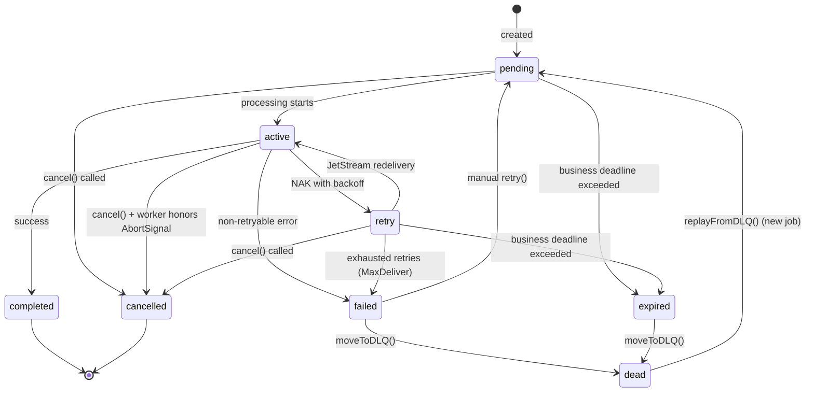

# ADR: Trellis Job Management

## Status

Proposed

## Context

Services need a means of:

- Tracking work in progress for UI visibility
- Handleing retries of failed work with backoff
- Reporting progress on long-running operations
- Enabling observability across the system
- Allowing UIs to query all jobs without knowing all services

Trellis services should adhere to the guidelines in [adr-trellis-patterns.md](./adr-trellis-patterns.md).

## Decision

This ADR defines `@trellis/jobs`:

- A **server library** for services to manage their own jobs
- A **client library** for UIs to query, watch, and manage jobs across all services

This ADR also defines an "Infrastructure" service `jobs` for global operations, janitor, and KV projection

`trellis.jobs@v1` remains a normal Trellis contract. For Jobs we expect to author it in language-specific source alongside its implementation and emit generated release artifacts plus SDKs. It is not a handwritten special case in Trellis runtime behavior.

### Design Principles

1. **Stream-first architecture** — JetStream stream is the source of truth. KV is a derived projection for queries.
2. **Jobs service** — Owns janitor, global RPCs, and KV projection. Stateless and horizontally scalable.
3. **Service-local processing** — Each service processes its own jobs via its own consumer.
4. **Instance-based registry** — Services register per-instance with TTL for auto-cleanup.
5. **Stream-driven observability** — Job state changes publish messages to the jobs stream (these are not `events.v1.*` domain events).

### Job States

| State       | Description                                |
| ----------- | ------------------------------------------ |
| `pending`   | Job created, waiting to be processed       |
| `active`    | Currently being processed                  |
| `retry`     | NAK sent, awaiting JetStream redelivery    |
| `completed` | Successfully finished                      |
| `failed`    | Exhausted retries, can be manually retried |
| `cancelled` | Cancelled before completion (terminal)     |
| `expired`   | Exceeded business deadline (terminal)      |
| `dead`      | Moved to DLQ, requires replayFromDLQ()     |

**State transitions:**



**Cancellation semantics:**

- `pending`/`retry`: Immediate cancellation (job never processed or won't be retried)
- `active`: Best-effort. The `JobManager` fires the handler's `AbortSignal`. Worker *should* check `abortSignal.aborted` periodically, but cancellation is cooperative—if the worker ignores it, the job completes normally.
- Terminal states (`completed`, `failed`, `cancelled`, `expired`, `dead`): No-op

### Storage Architecture

**Source of Truth: JetStream Stream (`JOBS`)**

- Stream: `JOBS`
- Subject pattern: `trellis.jobs.<service>.<job-type>.<job-id>.<event>`
- Message subjects:
  - `trellis.jobs.<service>.<job-type>.<job-id>.created` — includes full payload
  - `trellis.jobs.<service>.<job-type>.<job-id>.started`
  - `trellis.jobs.<service>.<job-type>.<job-id>.retry`
  - `trellis.jobs.<service>.<job-type>.<job-id>.progress`
  - `trellis.jobs.<service>.<job-type>.<job-id>.logged`
  - `trellis.jobs.<service>.<job-type>.<job-id>.completed`
  - `trellis.jobs.<service>.<job-type>.<job-id>.failed`
  - `trellis.jobs.<service>.<job-type>.<job-id>.cancelled`
  - `trellis.jobs.<service>.<job-type>.<job-id>.expired`
  - `trellis.jobs.<service>.<job-type>.<job-id>.retried`
  - `trellis.jobs.<service>.<job-type>.<job-id>.dead`
- Retention: Limits-based (configurable)

These subjects are namespaced to the jobs subsystem (`trellis.jobs.*`) and are described by the `trellis.jobs@v1` contract as raw pub/sub subjects (rather than `events.v1.*` contract events).

**Subject filtering examples:**

| Pattern | Description |
| ------- | ----------- |
| `trellis.jobs.>` | All job events across all services |
| `trellis.jobs.<service>.>` | All events for a specific service |
| `trellis.jobs.<service>.<job-type>.>` | All events for a specific job type |
| `trellis.jobs.*.*.<job-id>.>` | All events for a specific job (any service/type) |
| `trellis.jobs.<service>.<job-type>.<job-id>.>` | All events for a specific job (fully qualified) |
| `trellis.jobs.*.*.*.completed` | All completion events across services |

All job state changes are published to this stream. The stream is append-only and replayable. The `.created` event contains the full job payload, enabling stream replay to reconstruct job state.

**Work Queue: JetStream Stream (`JOBS_WORK`)**

- Stream: `JOBS_WORK`
- **Sources from `JOBS`** — automatically populated via stream sourcing (see Provisioning Model)
- Subject pattern: `trellis.work.<service>.<job-type>`
- Consumer: Per job-type durable consumer (allows different BackOff/AckWait per type)
- Retention: WorkQueue policy

When a service calls `JobManager.create()`, it publishes a `.created` event to `JOBS`. The `JOBS_WORK` stream is configured to source `.created` and `.retried` events from `JOBS` with a subject transform, automatically populating the work queue. This keeps initial enqueue and manual retry stream-first and replayable.

**Consumer configuration (per job-type):**

```
MaxDeliver: 5
BackOff: 5s, 30s, 2m, 10m, 30m
AckPolicy: Explicit
AckWait: 5m (must exceed expected job duration)
```

**Advisory Stream (`JOBS_ADVISORIES`)**

- Stream: `JOBS_ADVISORIES`
- Subject: `$JS.EVENT.ADVISORY.CONSUMER.MAX_DELIVERIES.JOBS_WORK.>`
- Purpose: Durable capture of max-delivery advisories for reliable failure detection

When a work message exhausts `MaxDeliver`, NATS emits an advisory. By capturing these in a stream, the `jobs` service can reliably detect exhausted jobs even if it was temporarily unavailable.

**KV Buckets**

Two separate buckets for different retention needs:

**`trellis_jobs`** — Projected job state
- Keys: `<service>.<job-type>.<job-id>` → Job JSON
- No TTL (jobs persist until explicitly cleaned up)
- Maintained by `jobs` service projector

**`trellis_service_instances`** — Service instance registry
- Keys: `<service>.<instance-id>` → ServiceRegistration JSON
- TTL: 60 seconds (auto-expires if instance stops heartbeating)
- Written directly by services (heartbeat every 30s)

This bucket is intentionally distinct from the `trellis` service's permanent `trellis_services` registry of service principals.

### Provisioning Model

Shared Jobs infrastructure is declared through contract resource requests and provisioned through the normal contract install or upgrade flow plus bindings for the `jobs` service, not created by the `jobs` service at runtime.

- `trellis.jobs@v1` declares the shared streams and KV buckets needed by the jobs subsystem
- the `jobs` service should install and start up like other non-`trellis` services
- the `trellis` service installs the contract and provisions or binds the requested resources for the `jobs` service
- the `jobs` service and service-local workers create only dynamic per-job-type consumers at runtime
- the runtime should consume those bindings, rather than hard-coding an imperative infrastructure setup path

This ADR depends on the contract resource model in `adr-trellis-contracts-catalog.md` supporting JetStream streams and their source transforms.

The `trellis.jobs@v1` contract should request resources that resolve to shared Jobs infrastructure during service install or upgrade. The JSON examples below show the resolved JetStream or KV configuration the Jobs runtime expects after binding; the contract request itself should use logical aliases as described in `adr-trellis-contracts-catalog.md`.

**Stream: `JOBS`**
```json
{
  "name": "JOBS",
  "subjects": ["trellis.jobs.>"],
  "retention": "limits",
  "max_msgs": -1,
  "max_bytes": -1,
  "max_age": 0,
  "storage": "file",
  "num_replicas": 3,
  "discard": "old"
}
```

**Stream: `JOBS_WORK`**
```json
{
  "name": "JOBS_WORK",
  "subjects": ["trellis.work.>"],
  "retention": "workqueue",
  "storage": "file",
  "num_replicas": 3,
  "sources": [
    {
      "name": "JOBS",
      "filter_subject": "trellis.jobs.*.*.*.created",
      "subject_transform_dest": "trellis.work.$1.$2"
    },
    {
      "name": "JOBS",
      "filter_subject": "trellis.jobs.*.*.*.retried",
      "subject_transform_dest": "trellis.work.$1.$2"
    }
  ]
}
```

The `sources` configuration automatically replicates `.created` and `.retried` events from `JOBS` into `JOBS_WORK` with a subject transform: `trellis.jobs.<service>.<job-type>.<job-id>.<event>` → `trellis.work.<service>.<job-type>`.

**Stream: `JOBS_ADVISORIES`**
```json
{
  "name": "JOBS_ADVISORIES",
  "subjects": ["$JS.EVENT.ADVISORY.CONSUMER.MAX_DELIVERIES.JOBS_WORK.>"],
  "retention": "limits",
  "max_age": 604800000000000,
  "storage": "file",
  "num_replicas": 1
}
```

**KV Bucket: `trellis_jobs`**
```json
{
  "bucket": "trellis_jobs",
  "storage": "file",
  "num_replicas": 3
}
```

**KV Bucket: `trellis_service_instances`**
```json
{
  "bucket": "trellis_service_instances",
  "storage": "file",
  "num_replicas": 3,
  "ttl": 60000000000
}
```

**Consumer: Per job-type (created dynamically)**

Each service creates a durable consumer for its job types:

```json
{
  "durable_name": "<service>-<job-type>",
  "filter_subject": "trellis.work.<service>.<job-type>",
  "ack_policy": "explicit",
  "ack_wait": 300000000000,
  "max_deliver": 5,
  "backoff": [5000000000, 30000000000, 120000000000, 600000000000, 1800000000000]
}
```

**Scaling note:** For v1, the projector uses a single consumer. If horizontal scaling is needed, NATS `partition()` function enables deterministic partitioning by job-id for parallel projection while maintaining per-job ordering.

### Jobs Service

A dedicated `jobs` service provides observability and management. It is **not required for job processing**—services can create and process jobs independently. The `jobs` service adds:

1. **KV Projection** — Consumes `JOBS` stream via single durable consumer, updates `trellis_jobs` KV bucket
2. **Janitor** — Enforces business `deadline` expiry (not AckWait—JetStream handles redelivery)
3. **Advisory Consumer** — Consumes `JOBS_ADVISORIES` stream to detect exhausted deliveries
4. **Global RPCs** — ListServices, ListJobs, GetJob, Cancel, Retry, DLQ management

The jobs service is stateless. If it's unavailable, job processing continues normally; only UI visibility and deadline enforcement pause until it recovers.

### Service Registration

Services register per-instance on startup:

```typescript
type ServiceRegistration = {
  service: string;
  instanceId: string;
  jobTypes: string[];
  registeredAt: string;
  heartbeatAt: string;
};
```

**TTL-based cleanup:**

- KV entry TTL: 60 seconds
- Instance updates heartbeat every 30 seconds
- If instance dies, entry auto-expires
- `listServices()` aggregates by service name

### Job Schema

```typescript
type Job<TPayload = unknown, TResult = unknown> = {
  id: string;
  service: string;
  type: string;
  state: JobState;

  payload: TPayload;
  result?: TResult;

  createdAt: string;
  updatedAt: string;
  startedAt?: string;
  completedAt?: string;

  tries: number;
  maxTries: number;
  lastError?: string;

  deadline?: string;
  heartbeatAt?: string;

  progress?: {
    current: number;
    total: number;
    message?: string;
  };

  logs?: JobLogEntry[];
};

type JobLogEntry = {
  timestamp: string;
  level: "info" | "warn" | "error";
  message: string;
};

type JobState =
  | "pending"
  | "active"
  | "retry"
  | "completed"
  | "failed"
  | "cancelled"
  | "expired"
  | "dead";
```

### Lifecycle Events

Job state changes are published to the `JOBS` stream:

**Subject:** `trellis.jobs.<service>.<job-type>.<job-id>.<event-type>`

**Event types:**

- `created` — Job enqueued (includes full payload for stream reconstruction)
- `started` — Processing began
- `retry` — Worker requested redelivery via NAK/backoff
- `progress` — Progress update (structured: current/total/message)
- `logged` — Log entry added (contains only new entries; `jobs` service aggregates full history to KV)
- `completed` — Successfully finished (includes result)
- `failed` — Retries exhausted or non-retryable
- `cancelled` — Job was cancelled
- `expired` — Business deadline exceeded
- `retried` — Manual retry triggered
- `dead` — Moved to DLQ

**Payload:**

```typescript
type JobEvent<TPayload = unknown, TResult = unknown> = {
  jobId: string;
  service: string;
  jobType: string;
  eventType: string;
  state: JobState;
  previousState?: JobState;
  tries: number;
  error?: string;
  progress?: { current: number; total: number; message?: string };
  logs?: JobLogEntry[];
  payload?: TPayload;
  result?: TResult;
  timestamp: string;
};
```

The `payload` field is **required** on `.created` events and enables full job reconstruction from stream replay. It may be omitted on subsequent events to reduce message size.

### Retry Policy

Retry timing handled by NATS consumer `BackOff` configuration:

```typescript
type RetryConfig = {
  maxDeliver: number;
  backoff: number[];
  ackWait: number;
};

const defaultRetryConfig: RetryConfig = {
  maxDeliver: 5,
  backoff: [5000, 30000, 120000, 600000, 1800000],
  ackWait: 300000, // 5 minutes
};
```

**Long-running jobs:** If job duration may exceed `ackWait`, the handler must call `job.heartbeat()` to extend the ack deadline (sends `inProgress()` to NATS).

### Server Library API

`@trellis/jobs` exports a `JobManager` class for services:

```typescript
import { z } from "zod";

class JobManager<TPayload, TResult> {
  constructor(trellis: TrellisServer, options: JobManagerOptions);

  async create(type: string, payload: TPayload): Promise<Job<TPayload>>;

  async process<T>(
    schema: z.ZodSchema<T>,
    handler: (job: ActiveJob<T>) => Promise<TResult>,
  ): Promise<void>;

  async get(jobId: string): Promise<Job<TPayload, TResult> | null>;
  async list(filter?: JobFilter): Promise<Job<TPayload, TResult>[]>;
  async retry(jobId: string): Promise<Job<TPayload>>;
  async cancel(jobId: string): Promise<Job<TPayload>>;
  async moveToDLQ(jobId: string, reason: string): Promise<void>;

  async start(): Promise<void>;
  async stop(): Promise<void>;
}

type ActiveJob<TPayload> = Job<TPayload> & {
  updateProgress(
    current: number,
    total: number,
    message?: string,
  ): Promise<void>;
  log(level: "info" | "warn" | "error", message: string): Promise<void>;
  heartbeat(): Promise<void>;
  abortSignal: AbortSignal;
};

type JobManagerOptions = {
  retryConfig?: RetryConfig;
  defaultDeadline?: number;
  concurrency?: number;
};

type JobFilter = {
  service?: string;
  state?: JobState | JobState[];
  type?: string;
  since?: string;
  limit?: number;
};
```

**Schema validation:** `process()` takes a zod schema. Payload is validated before handler runs. Invalid payloads immediately fail (non-retryable).

**Cancellation:** `ActiveJob.abortSignal` allows cooperative cancellation. The `JobManager` internally subscribes to `.cancelled` events for its service's jobs and triggers the corresponding `AbortController`. Handler should check `abortSignal.aborted` periodically.

**Idempotency:** Workers should use `msg.info.redeliveryCount` (provided by JetStream) to detect redeliveries and implement idempotent handling where necessary.

### Client Library API

`@trellis/jobs/client` exports a `JobClient` for UIs:

```typescript
class JobClient {
  constructor(trellis: TrellisClient);

  async listServices(): Promise<ServiceInfo[]>;

  async list(filter?: JobFilter): Promise<Job[]>;
  async get(service: string, jobType: string, jobId: string): Promise<Job | null>;
  async retry(service: string, jobType: string, jobId: string): Promise<Job>;
  async cancel(service: string, jobType: string, jobId: string): Promise<Job>;

  async listDLQ(filter?: DLQFilter): Promise<Job[]>;
  async replayFromDLQ(service: string, jobType: string, jobId: string): Promise<Job>;
  async removeFromDLQ(service: string, jobType: string, jobId: string): Promise<void>;

  watch(filter?: JobFilter): AsyncIterable<JobEvent>;
}

type ServiceInfo = {
  name: string;
  instances: ServiceRegistration[];
  healthy: boolean;
};
```

### RPC Endpoints

All job RPCs are centralized in the `jobs` service. The service reads from KV (projected from stream) and publishes commands to the appropriate work queue subjects.

| RPC                 | Input                       | Output          | Description                    |
| ------------------- | --------------------------- | --------------- | ------------------------------ |
| `Jobs.ListServices` | `{}`                        | `ServiceInfo[]` | List all registered services   |
| `Jobs.List`         | `JobFilter`                 | `Job[]`         | List jobs (filterable)         |
| `Jobs.Get`          | `{ service, jobType, id }`  | `Job`           | Get single job                 |
| `Jobs.Retry`        | `{ service, jobType, id }`  | `Job`           | Manually retry a failed job    |
| `Jobs.Cancel`       | `{ service, jobType, id }`  | `Job`           | Cancel a pending/retry job     |
| `Jobs.ListDLQ`      | `DLQFilter`                 | `Job[]`         | List dead letter jobs          |
| `Jobs.ReplayDLQ`    | `{ service, jobType, id }`  | `Job`           | Replay job from DLQ            |
| `Jobs.RemoveDLQ`    | `{ service, jobType, id }`  | `{}`            | Remove job from DLQ            |

### Failure Detection

**Business deadline expiry (Janitor):**

The janitor enforces the `deadline` field on jobs—a business-level SLA (e.g., "must complete within 24 hours"). It does NOT compete with JetStream's `AckWait`/redelivery mechanism.

1. Periodically scans `trellis_jobs` KV for jobs where `deadline < now` and state is not terminal
2. Emits `.expired` event for matching jobs
3. Does NOT touch `active` jobs based on heartbeat staleness—JetStream handles processing timeouts via AckWait

**Exhausted deliveries (Advisory Consumer):**

When a work message exceeds `MaxDeliver`, NATS emits an advisory captured in `JOBS_ADVISORIES` stream. The advisory consumer:

1. Consumes from `JOBS_ADVISORIES` with a durable consumer
2. Extracts job ID from the advisory payload
3. Emits `.failed` event if the job hasn't already reached a terminal state

This approach is durable—if the `jobs` service is temporarily unavailable, advisories accumulate in the stream and are processed on recovery.

### Authorization

Jobs uses normal Trellis capabilities plus service-identity-aware permission derivation. The system does **not** grant one broad capability that lets a caller publish or consume jobs for arbitrary services.

As in `adr-trellis-auth.md` and `adr-trellis-contracts-catalog.md`, runtime service ownership is derived from the installed service principal and installed contract record, not from contract metadata alone. The `<service>` subject segment used by Jobs must therefore be bound to the installed service identity used for routing and permission derivation.

| Capability / rule        | Permissions                                                      |
| ------------------------ | ---------------------------------------------------------------- |
| `jobs.read`              | Call read RPCs and subscribe `trellis.jobs.>`                    |
| `jobs.admin`             | Call mutating Jobs RPCs and operate projector / DLQ internals    |
| service identity + jobs runtime ownership | Publish `trellis.jobs.<service>.>` and consume `trellis.work.<service>.>` for the caller's own service only |

**Scope assignments:**

| Actor           | Grants                                              |
| --------------- | --------------------------------------------------- |
| Services        | `service` plus derived service-local jobs subjects  |
| `jobs` service  | `service` + `jobs.read` + `jobs.admin`              |
| Admin UIs       | `jobs.read` + `jobs.admin`                          |

Note: Regular users don't interact with jobs directly. Job visibility for end-users (e.g., "see progress of my document processing") would be exposed through domain-specific APIs, not the jobs system.

### Retention

Retention strategy is implementation-specific, not mandated:

**Options:**

1. **Keep all** — Jobs as audit log, accept growth
2. **TTL per state** — completed: 7d, failed: 30d, dead: 90d
3. **Archive** — Move old jobs to archive bucket/cold storage

The central jobs service can implement periodic cleanup or archival as configured.

### Example Usage

```typescript
import { JobManager } from "@trellis/jobs";
import { z } from "zod";

	const DocumentPayload = z.object({
	  documentId: z.object({ origin: z.string(), id: z.string() }),
	  objectKey: z.string(),
	});

	type DocumentProcessingResult = unknown;

	const jobs = new JobManager<
	  z.infer<typeof DocumentPayload>,
	  DocumentProcessingResult
	>(trellis, {
  retryConfig: {
    maxDeliver: 5,
    backoff: [5000, 30000, 120000, 600000],
    ackWait: 600000, // 10 minutes for long OCR jobs
  },
  concurrency: 2,
});

await jobs.start();

	trellis.subscribe("Document.*.*.Created", async (event) => {
	  await jobs.create("document-process", {
	    documentId: event.documentId,
	    objectKey: event.objectKey,
	  });
	});

await jobs.process(DocumentPayload, async (job) => {
  if (job.abortSignal.aborted) return;

	  await job.log("info", "Starting document processing");
  await job.updateProgress(0, 100, "Classifying document");

  const docType = await classify(job.payload.objectKey);

  if (job.abortSignal.aborted) return;
  await job.heartbeat(); // Extend ack deadline for long jobs
  await job.updateProgress(20, 100, "Extracting text");

  const result = await extract(job.payload.objectKey, docType);
  await job.updateProgress(100, 100, "Complete");

  return result;
});
```

### Library Structure

```text
js/packages/jobs/
├── mod.ts               # Server exports (JobManager)
├── client.ts            # Client exports (JobClient)
├── job-manager.ts       # JobManager implementation
├── job-client.ts        # JobClient implementation
├── storage.ts           # Binding-aware KV helpers
├── stream.ts            # JetStream publish (source of truth)
├── consumer.ts          # Work queue consumer setup
├── events.ts            # Event types and helpers
└── types.ts             # Job, JobState, schemas

js/services/jobs/
├── main.ts              # Central jobs service
├── projector.ts         # JOBS stream → KV projection
├── janitor.ts           # Business deadline enforcement
├── advisory.ts          # MaxDeliver advisory consumer
└── rpcs.ts              # Global RPC handlers

rust/crates/trellis-jobs/
└── src/
    ├── lib.rs          # Public exports
    ├── client.rs       # Jobs RPC client
    ├── manager.rs      # Service-local JobManager
    ├── stream.rs       # JetStream publish helpers
    ├── projection.rs   # Reducer / projector logic
    └── types.rs        # Shared models and serde types

rust/crates/trellis-jobs-service/
└── src/
    ├── main.rs         # Service entrypoint
    ├── projector.rs    # JOBS stream → KV projection
    ├── janitor.rs      # Business deadline enforcement
    ├── advisory.rs     # MaxDeliver advisory consumer
    └── rpcs.rs         # Global RPC handlers
```

### Implementation Notes

**Payload size:** Job payloads should be kept small. For large data (documents, images), store in Object Store and pass references in the payload.

**Progress events:** Services should be mindful of progress event frequency. While not enforced, high-frequency updates (e.g., every millisecond) create unnecessary stream volume. KV only stores the latest progress state.

**Retry vs redelivery:** The `retry` state indicates "NAK sent, awaiting JetStream redelivery"—the worker is NOT running. When JetStream redelivers the message and the worker starts, a `started` event is emitted transitioning back to `active`.

**Terminal state precedence:** If a race occurs (e.g., janitor marks job `expired` while worker is finishing), terminal states take precedence. The projector should reject state transitions from terminal states (except explicit operations like `replayFromDLQ`).

## Consequences

### Benefits

- **Reliable state** — Stream is source of truth; KV is derived. No atomicity issues.
- **Atomic job creation** — Stream sourcing ensures single publish creates both audit trail and work item.
- **Durable failure detection** — Advisory stream captures exhausted deliveries reliably.
- **Cross-service visibility** — Central service provides global queries without coupling services.
- **Schema validation** — Zod prevents poison-pill messages.
- **Cooperative cancellation** — AbortSignal allows clean shutdown.
- **Instance-aware registry** — TTL handles crashed instances automatically.

### Trade-offs

- **Central service for visibility** — The `jobs` service adds operational complexity, but is optional for core job processing and stateless.
- **Consumer-level retry config** — BackOff is per-consumer (per job-type), not per-job.
- **Single projector for v1** — KV projection uses single consumer for ordering; can scale via `partition()` if needed.
- **No cross-service dependencies** — v1 doesn't support job chaining.
- **No scheduling** — Deferred/recurring jobs not in v1.

### Future Work

- Job dependencies (within service)
- Cross-service job chaining
- Scheduled/recurring jobs
- Job priorities
- Payload encryption at rest
