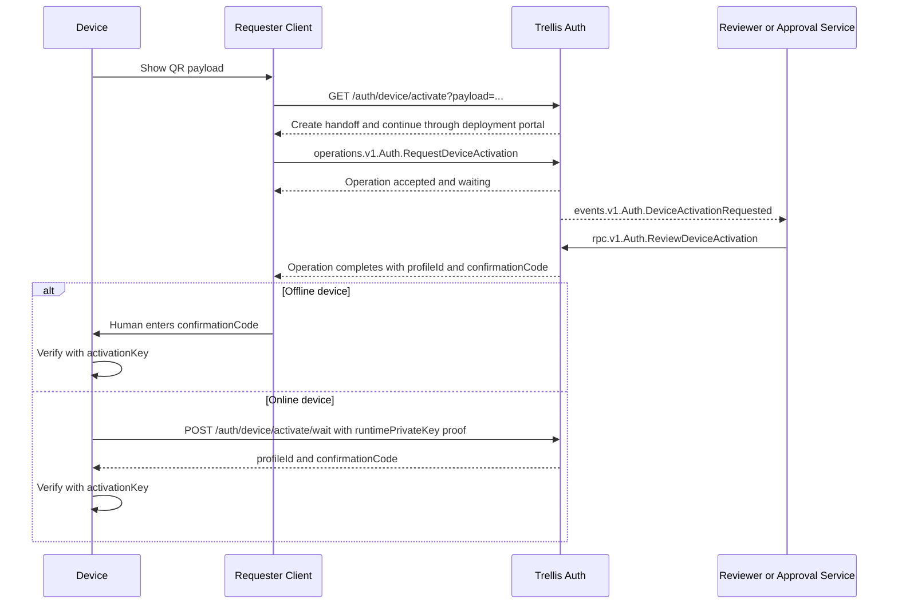
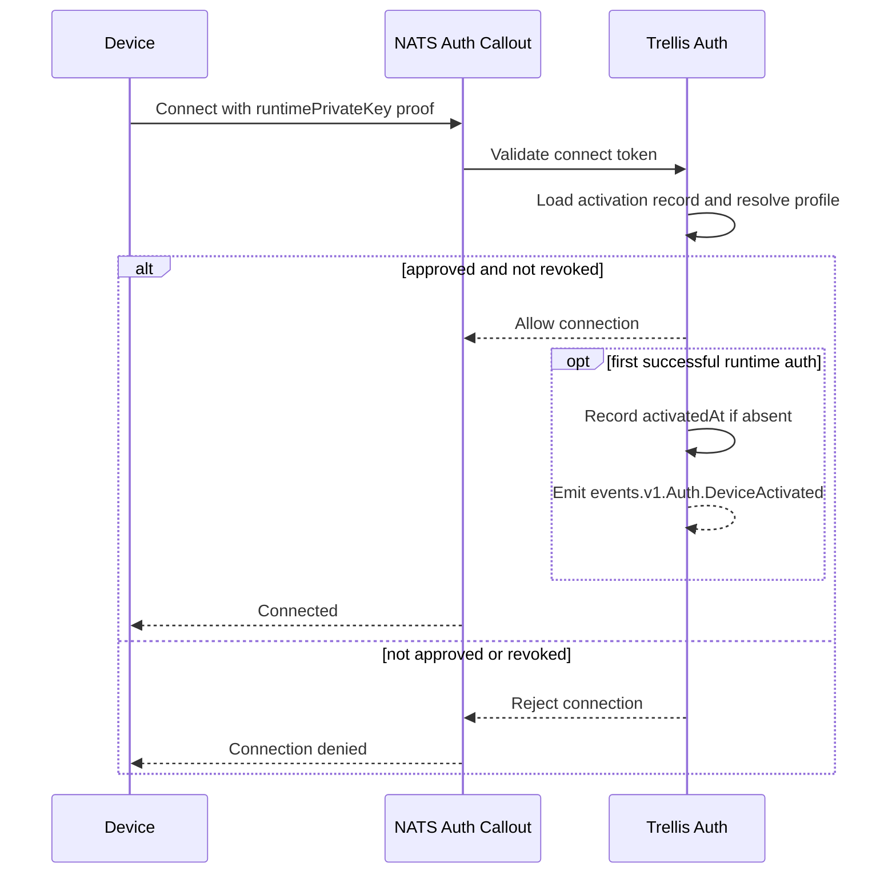

# Design: Device Activation

## Prerequisites

- [trellis-auth.md](./trellis-auth.md) - auth architecture and principal model
- [auth-api.md](./auth-api.md) - auth HTTP, operation, RPC, and event surfaces
- [auth-protocol.md](./auth-protocol.md) - proofs, internal state, and pre-auth
  device wait rules
- [../operations/trellis-operations.md](./../operations/trellis-operations.md) -
  caller-visible async workflow model
- [../contracts/trellis-contracts-catalog.md](./../contracts/trellis-contracts-catalog.md) -
  profile lineage and allowed-digest rules

## Context

Trellis needs an activation flow for known devices that:

- have their own durable identity
- may be offline during setup
- may have constrained input
- can send an outbound QR payload to a phone or other admin client
- may need a human or automatic approval step before activation is allowed
- use normal Trellis runtime auth with the device runtime key once they are
  online

The authenticated user in the request flow is usually not authorized to activate
the device directly. That user is allowed to request activation. A separate
reviewer, either a human admin or an approval service reacting to auth events,
decides whether activation should be approved.

This means device activation has three separate concerns:

- browser or client continuity while the requester signs in and starts the
  request
- a requester-visible asynchronous activation request
- a privileged review step that creates the actual auth activation record

## Design

### End-to-end flows

The main activation flow is request and review driven. The requester starts an
auth-owned operation, an authorized reviewer resolves it, and the resulting
confirmation code is delivered either to the requester for manual entry or
directly to an online device.



Normal runtime auth still happens later, after local confirmation succeeds. Once
that online auth succeeds, the device joins the same Trellis session model as
other callers as a `device` session.



### Device identity and keys

Each device is its own Trellis principal.

- the device later authenticates with its own runtime key, not as the user who
  requested activation
- the requester identity and the device identity are intentionally separate
- the short confirmation code is only local setup confirmation; it is never the
  device's online credential

Each manufactured device starts from one root secret:

```text
deviceRootSecret: 32 random bytes
```

The device derives purpose-specific keys with HKDF-SHA256:

```text
runtimeSeed   = HKDF-SHA256(ikm=deviceRootSecret, salt="", info="trellis/device-runtime/v1", L=32)
activationKey = HKDF-SHA256(ikm=deviceRootSecret, salt="", info="trellis/device-activate/v1", L=32)
```

The runtime keypair is:

```text
runtimePrivateKey = Ed25519Seed(runtimeSeed)
runtimePublicKey  = Ed25519Public(runtimePrivateKey)
```

Rules:

- `runtimePrivateKey` is the real online credential
- `activationKey` is used only for QR MACs and the offline confirmation code
- auth reads the activation secret material from its protected device-registry
  data; other callers do not

### Device profiles

`DeviceProfile` is an auth-owned record used at review time and online auth
time.

```json
{
  "profileId": "drive.default",
  "deviceType": "drive",
  "contractId": "acme.drive@v1",
  "allowedDigests": ["<digest-v1>", "<digest-v2>"],
  "preferredDigest": "<digest-v2>",
  "disabled": false
}
```

Rules:

- `profileId` is the stable server-side identifier attached to the device
  activation record
- `contractId` identifies one contract lineage
- `allowedDigests` may contain multiple active digests in that lineage during
  rollout
- `preferredDigest` is the rollout target for newly reviewed devices
- reviewers choose and attach the profile during
  `rpc.v1.Auth.ReviewDeviceActivation`

### Activation records

The flow uses three different records.

`DeviceActivationHandoff` preserves QR context across login or account creation.

```json
{
  "handoffId": "dah_...",
  "deviceId": "dev_...",
  "deviceType": "drive",
  "runtimePublicKey": "<base64url>",
  "nonce": "<base64url>",
  "qrMac": "<base64url>",
  "createdAt": "2026-04-05T12:00:00Z",
  "expiresAt": "2026-04-05T12:30:00Z"
}
```

`DeviceActivationRequest` is the requester-visible async object.

```json
{
  "requestId": "dar_...",
  "handoffId": "dah_...",
  "deviceId": "dev_...",
  "deviceType": "drive",
  "runtimePublicKey": "<base64url>",
  "nonce": "<base64url>",
  "requestedProfileId": "drive.default",
  "requestedBy": {
    "origin": "google",
    "id": "1234"
  },
  "state": "pending",
  "createdAt": "2026-04-05T12:05:00Z",
  "expiresAt": "2026-04-05T13:05:00Z"
}
```

`requestedProfileId` is optional. It is only a requester hint; the reviewer may
approve a different profile or select one when the request omitted a hint.

The auth activation record is the actual device auth decision.

```json
{
  "requestId": "dar_...",
  "deviceId": "dev_...",
  "runtimePublicKey": "<base64url>",
  "profileId": "drive.default",
  "state": "approved",
  "approvedAt": "2026-04-05T12:08:00Z",
  "activatedAt": null,
  "revokedAt": null
}
```

### Outbound QR payload

The QR payload is the outbound handoff from device to requester.

```json
{
  "v": 1,
  "deviceId": "dev_...",
  "deviceType": "drive",
  "runtimePublicKey": "<base64url>",
  "nonce": "<base64url>",
  "qrMac": "<base64url>"
}
```

`qrMac` is computed as:

```text
qrMac = base64url(
  Trunc64(HMAC-SHA256(
    activationKey,
    "trellis-device-qr/v1" || deviceId || deviceType || runtimePublicKey || nonce
  ))
)
```

### Handoff HTTP entrypoint

The default browser entrypoint is:

```text
GET /auth/device/activate?payload=<base64url-json>
```

This entrypoint preserves device context across login and routes the browser
through two deployment-owned bindings: the deployment portal for generic auth UX
and the device onboarding handler for the specific `deviceType`. It does not
create the real activation record and it does not define the onboarding UI.

Behavior:

1. Decode the QR payload
2. Validate structural fields and version
3. Create `DeviceActivationHandoff`
4. If the caller is not authenticated, redirect into the normal login flow
   through portal while preserving `handoffId`
5. After auth continuity is restored, return a normal server-generated redirect
   that sends the browser into the selected onboarding route for the preserved
   `handoffId`

Auth resolves generic browser auth UX through a deployment-level portal binding
and resolves onboarding handlers from separate deployment-owned records keyed by
`deviceType`. Each device type needs an explicit active handler binding. That
binding may route to a custom onboarding app or select the Trellis default
onboarding app for that device type. If no active binding exists, auth rejects
the handoff instead of guessing a default.

The selected onboarding handler owns device-specific onboarding tasks and
screens. It may branch on the approved profile after review. When a device type
is bound to the Trellis default onboarding app, that default onboarding UX may
be served inside portal while still remaining a separate routing decision from
generic login and contract approval. Portal should treat the post-login next
step as an opaque redirect target from auth rather than inventing its own
activation-continuation URL. `rpc.v1.Auth.ReviewDeviceActivation` performs the
known-device check, runtime-key check, and profile attachment.

### Onboarding handler registration

Auth stores deployment-owned onboarding handler records.

```json
{
  "handlerId": "drive.onboard",
  "matchDeviceType": "drive",
  "mode": "custom",
  "contractId": "acme.drive-onboarding@v1",
  "entryUrl": "https://console.example.com/devices/drive/onboard",
  "disabled": false
}
```

Rules:

- `matchDeviceType` is required and selects one device type
- `mode` is either `custom` or `trellis_default`
- only one active handler binding may exist for a given `matchDeviceType`
- handler registration is an auth admin action, not runtime self-registration
- `contractId` and `entryUrl` are required when `mode` is `custom`
- `contractId` and `entryUrl` are omitted when `mode` is `trellis_default`
- when `mode` is `custom`, the referenced `contractId` must be active in the
  deployment catalog
- when `mode` is `custom`, the referenced contract must declare the auth
  surfaces the onboarding app uses, at minimum the ability to start
  `operations.v1.Auth.RequestDeviceActivation`

Auth resolves handler bindings only for routing. Approval policy may be
implemented by a separate service. Deployments manage these records through
`rpc.v1.Auth.CreateDeviceOnboardingHandler`,
`rpc.v1.Auth.ListDeviceOnboardingHandlers`, and
`rpc.v1.Auth.DisableDeviceOnboardingHandler`.

### Approval services

The onboarding handler and the approval service may be different deployments or
different contracts.

A deployment-specific approval service may subscribe to
`events.v1.Auth.DeviceActivationRequested`, run external checks such as
subscription or tenant policy validation, and call
`rpc.v1.Auth.ReviewDeviceActivation` once its own requirements are satisfied.

Automatic approval is therefore a deployment workflow layered on top of auth
events and auth review, not a bypass around auth.

### Requester-facing operation

The requester-facing public API is the auth-owned operation subject:

```text
operations.v1.Auth.RequestDeviceActivation
```

Logical name:

```text
Auth.RequestDeviceActivation
```

The operation starts the request and then waits for review.

Request:

```json
{
  "handoffId": "dah_...",
  "requestedProfileId": "drive.default"
}
```

`requestedProfileId` is optional. When present it is advisory, not
authoritative.

Start-time validation errors use `AuthError` and reject the operation before it
is accepted.

Start-time reason codes:

| Scenario                  | Reason code                           |
| ------------------------- | ------------------------------------- |
| `handoffId` missing       | `missing_handoff_id`                  |
| handoff not found         | `device_activation_handoff_not_found` |
| handoff expired           | `device_activation_handoff_expired`   |
| requester session missing | `session_not_found`                   |

Progress payload:

```json
{
  "stage": "pending_review"
}
```

Terminal success payload:

```json
{
  "requestId": "dar_...",
  "profileId": "drive.default",
  "confirmationCode": "7K2M9QXD"
}
```

Terminal failure errors use the normal operation failed state with an
`AuthError` payload.

Terminal failure reason codes:

| Scenario                                | Reason code                         |
| --------------------------------------- | ----------------------------------- |
| request rejected by reviewer            | `device_activation_rejected`        |
| request expired before review completed | `device_activation_request_expired` |

Behavior:

1. Require a normal authenticated requester session
2. Load `DeviceActivationHandoff`
3. Create `DeviceActivationRequest`
4. Persist enough requester identity to support audit and requester-bound
   operation authorization
5. Emit `events.v1.Auth.DeviceActivationRequested`
6. Move the operation into a waiting state until the request is reviewed
7. Complete successfully with the approved `profileId` and `confirmationCode` if
   approved
8. Complete in failed state with `device_activation_rejected` or
   `device_activation_request_expired` if review does not approve the request in
   time

The operation is the public pause-resume surface for the requester. Internally,
auth may complete it via event projection, KV watch, or another implementation
detail, but those mechanisms are not part of the public API.

### Review RPC

The privileged review API is the auth RPC subject:

```text
rpc.v1.Auth.ReviewDeviceActivation
```

Logical name:

```text
Auth.ReviewDeviceActivation
```

Approved request:

```json
{
  "requestId": "dar_...",
  "approved": true,
  "profileId": "drive.default"
}
```

Rejected request:

```json
{
  "requestId": "dar_...",
  "approved": false,
  "reason": "policy_denied"
}
```

Approved response:

```json
{
  "requestId": "dar_...",
  "decision": "approved",
  "profileId": "drive.default",
  "approvedAt": "2026-04-05T12:08:00Z"
}
```

Rejected response:

```json
{
  "requestId": "dar_...",
  "decision": "rejected",
  "reason": "policy_denied",
  "rejectedAt": "2026-04-05T12:08:00Z"
}
```

Rules:

- callers must already be Trellis-authenticated and authorized for this RPC
- `profileId` is required when `approved` is `true`
- `reason` is optional and is primarily useful on rejection
- the same RPC handles both approval and rejection

Decision reason values are deployment-defined machine-readable strings.
`policy_denied` is an illustrative rejection code, not a fixed global enum.

Review reason codes:

| Scenario                                | Reason code                                  |
| --------------------------------------- | -------------------------------------------- |
| `requestId` missing                     | `missing_request_id`                         |
| request not found                       | `device_activation_request_not_found`        |
| request already resolved differently    | `device_activation_request_already_resolved` |
| `approved=true` and `profileId` missing | `missing_profile_id`                         |
| profile not found                       | `device_profile_not_found`                   |
| profile disabled                        | `device_profile_disabled`                    |
| device not known                        | `unknown_device`                             |
| QR MAC invalid                          | `invalid_qr_mac`                             |
| runtime key mismatch                    | `device_key_mismatch`                        |

On approval, auth:

1. Loads the `DeviceActivationRequest`
2. Verifies the device is a known device
3. Verifies the QR MAC using the device activation key
4. Verifies the known device runtime key matches the request runtime key
5. Loads and validates `DeviceProfile`
6. Creates or confirms the auth activation record with the approved `profileId`
   and state `approved`
7. Derives the confirmation code
8. Marks the request approved
9. Emits `events.v1.Auth.DeviceActivationApproved`
10. Completes `operations.v1.Auth.RequestDeviceActivation`

If the same request is reviewed again with the same final decision, auth may
return the existing final state idempotently. Conflicting re-review attempts
fail.

On rejection, auth:

1. Loads the `DeviceActivationRequest`
2. Marks the request rejected
3. Emits `events.v1.Auth.DeviceActivationRejected`
4. Completes `operations.v1.Auth.RequestDeviceActivation` in failed state with
   `device_activation_rejected`

### Online device wait endpoint

An online device should not require a human to type the confirmation code if it
can already reach auth.

The device therefore uses a pre-auth long-poll endpoint:

```text
POST /auth/device/activate/wait
```

Request:

```json
{
  "deviceId": "dev_...",
  "runtimePublicKey": "<base64url>",
  "nonce": "<base64url>",
  "iat": 1743854880,
  "sig": "<base64url-ed25519-signature>"
}
```

Response:

```json
{
  "status": "approved",
  "requestId": "dar_...",
  "profileId": "drive.default",
  "confirmationCode": "7K2M9QXD"
}
```

or:

```json
{
  "status": "rejected",
  "requestId": "dar_...",
  "reason": "policy_denied"
}
```

or:

```json
{
  "status": "pending"
}
```

The device proves possession of `runtimePrivateKey` before it is activated.

Behavior:

1. Verify `iat` is within the allowed skew window
2. Verify `sig` using `runtimePublicKey`
3. Find a matching pending or approved activation request by `deviceId`,
   `runtimePublicKey`, and `nonce`
4. If the request is already approved, return the confirmation code immediately
5. Otherwise wait for a bounded timeout for the request to resolve
6. Return approved, rejected, or pending-timeout status

Reason codes:

| Scenario                   | Reason code                           |
| -------------------------- | ------------------------------------- |
| `deviceId` missing         | `missing_device_id`                   |
| `runtimePublicKey` missing | `missing_runtime_public_key`          |
| `nonce` missing            | `missing_nonce`                       |
| `iat` missing              | `missing_iat`                         |
| `sig` missing              | `missing_sig`                         |
| `iat` outside allowed skew | `iat_out_of_range`                    |
| signature invalid          | `invalid_signature`                   |
| no matching request        | `device_activation_request_not_found` |

Offline devices still rely on the human-entered confirmation code. Online
devices may fetch that same code automatically through this endpoint.

### Confirmation code

The confirmation code is short because the device may have constrained input. It
is not an online credential.

```text
confirmTag = Trunc40(HMAC-SHA256(
  activationKey,
  "trellis-device-confirm/v1" || deviceId || nonce
))

confirmationCode = CrockfordBase32(confirmTag)
```

Rules:

- the code is exactly 8 Crockford Base32 characters
- the code does not carry permissions and is not reused for online auth
- auth may derive the code on demand instead of storing it in plaintext

### Device behavior after approval

Offline device flow:

1. requester receives the code from `operations.v1.Auth.RequestDeviceActivation`
2. human types the code into the device
3. device verifies the code locally with `activationKey`
4. device enters a local offline-activated state

Online device flow:

1. device waits on `POST /auth/device/activate/wait`
2. auth returns the same code once the request is approved
3. device verifies it locally and enters the same local offline-activated state

In both cases the device later performs normal runtime-key auth.

### First online auth

After local confirmation, the device uses normal Trellis auth with
`runtimePrivateKey`.

On each runtime auth after approval, auth resolves the device principal from the
activation record, including the already-attached `profileId`.

On the first successful runtime auth after approval, auth also:

1. loads the auth activation record by device identity
2. verifies the record is approved and not revoked
3. records `activatedAt` if it is still absent
4. emits `events.v1.Auth.DeviceActivated`

That first online auth records the first successful online use of the
already-approved device identity.

If the device is not approved, auth rejects online auth. If the device has been
revoked, auth rejects online auth and active connections should be kicked.

### Auth events

Auth publishes these activation events:

- `events.v1.Auth.DeviceActivationRequested`
- `events.v1.Auth.DeviceActivationApproved`
- `events.v1.Auth.DeviceActivationRejected`
- `events.v1.Auth.DeviceActivated`
- `events.v1.Auth.DeviceActivationRevoked`

These events let a human admin client or an automatic approver service react
without giving the original requester the capability to call
`rpc.v1.Auth.ReviewDeviceActivation`.

Suggested payloads:

`events.v1.Auth.DeviceActivationRequested`

```json
{
  "requestId": "dar_...",
  "deviceId": "dev_...",
  "deviceType": "drive",
  "runtimePublicKey": "<base64url>",
  "requestedProfileId": "drive.default",
  "requestedAt": "2026-04-05T12:05:00Z",
  "requestedBy": {
    "origin": "google",
    "id": "1234"
  }
}
```

`events.v1.Auth.DeviceActivationApproved`

```json
{
  "requestId": "dar_...",
  "deviceId": "dev_...",
  "runtimePublicKey": "<base64url>",
  "profileId": "drive.default",
  "approvedAt": "2026-04-05T12:08:00Z"
}
```

`events.v1.Auth.DeviceActivationRejected`

```json
{
  "requestId": "dar_...",
  "deviceId": "dev_...",
  "rejectedAt": "2026-04-05T12:08:00Z",
  "reason": "policy_denied"
}
```

`events.v1.Auth.DeviceActivated`

```json
{
  "requestId": "dar_...",
  "deviceId": "dev_...",
  "runtimePublicKey": "<base64url>",
  "profileId": "drive.default",
  "activatedAt": "2026-04-05T12:15:00Z"
}
```

`events.v1.Auth.DeviceActivationRevoked`

```json
{
  "deviceId": "dev_...",
  "runtimePublicKey": "<base64url>",
  "profileId": "drive.default",
  "revokedAt": "2026-04-05T13:00:00Z"
}
```

### Onboarding, profile, and admin RPCs

Device onboarding, profile, and lifecycle admin RPCs remain part of the auth
API:

- `rpc.v1.Auth.CreateDeviceOnboardingHandler`
- `rpc.v1.Auth.ListDeviceOnboardingHandlers`
- `rpc.v1.Auth.DisableDeviceOnboardingHandler`
- `rpc.v1.Auth.CreateDeviceProfile`
- `rpc.v1.Auth.ListDeviceProfiles`
- `rpc.v1.Auth.GetDeviceProfile`
- `rpc.v1.Auth.DisableDeviceProfile`
- `rpc.v1.Auth.SetDeviceProfilePreferredDigest`
- `rpc.v1.Auth.AddDeviceProfileDigest`
- `rpc.v1.Auth.RemoveDeviceProfileDigest`
- `rpc.v1.Auth.ListDeviceActivations`
- `rpc.v1.Auth.RevokeDeviceActivation`

Those RPCs manage deployment-owned onboarding routes, profile data, and
already-activated device records. The request-review flow above is the only path
that turns a requester action into a real activation decision.
