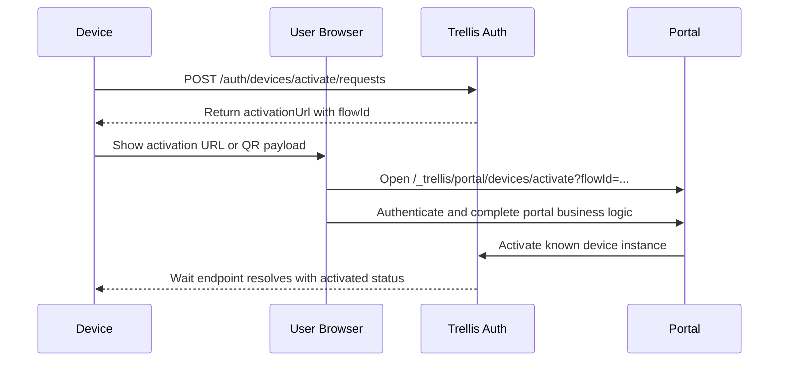

# Design: Device Activation

## Prerequisites

- [trellis-auth.md](./trellis-auth.md) - auth architecture and principal model
- [auth-api.md](./auth-api.md) - auth HTTP and RPC surfaces
- [auth-protocol.md](./auth-protocol.md) - proofs, connect payloads, and
  pre-auth wait rules
- [../contracts/trellis-contracts-catalog.md](./../contracts/trellis-contracts-catalog.md) -
  device lineage and allowed-digest rules

## Context

Trellis needs an activation flow for preregistered devices that:

- have their own durable identity
- may be offline during setup
- may have constrained input
- can send an outbound activation URL or QR payload to a phone or browser
- may later gain more product-specific business logic in the portal flow
- use normal Trellis runtime auth with the device identity key once they are
  online

This design makes `device` the primary architecture term for this activation
model.

Key decisions:

- `device` is the primary architecture term for this activation model
- activated devices are preregistered against deployment-owned device
  deployments
- the client does not choose a flow type or deployment during normal activation
- Trellis resolves the device instance, device deployment, and activation portal
  policy from preregistered records
- the activation portal is still a browser web app; if it calls Trellis after
  login, it does so as the logged-in user rather than as a service
- devices present an exact `contractDigest` at runtime; deployments validate
  `allowedDigests`
- device deployments do not carry a separate rollout-target digest field
- device review is a first-class optional gate controlled by `reviewMode`
- the provisioning/admin path may generate the device root secret locally, but
  Trellis stores only `publicIdentityKey` plus activation-only secret material
  rather than the root secret itself

## Design

### 1) Preregistered device instances are the primary path

Known device activation starts from a preregistered instance record.

The expected lifecycle is:

1. an admin or manufacturing/provisioning process provisions the device instance
   by `publicIdentityKey` and `activationKey`
2. that instance is attached to a device deployment
3. a user later activates the device through an authenticated portal flow
4. the activated device reconnects later by asking Trellis for current connect
   info

Unknown or self-registering devices may be added later as a separate extension.
They are not the primary v1 model.

### 2) Device identity is the durable principal

Each activated device is its own Trellis principal.

- the device later authenticates with its own identity key, not as the user who
  activated it
- the user identity and the device identity are intentionally separate
- any short confirmation code is only a local setup signal; it is never the
  device's online credential

Each device starts from one root secret:

```text
deviceRootSecret: 32 random bytes
```

The device derives purpose-specific keys with HKDF-SHA256:

```text
identitySeed  = HKDF-SHA256(ikm=deviceRootSecret, salt="", info="trellis/device-identity/v1", L=32)
activationKey = HKDF-SHA256(ikm=deviceRootSecret, salt="", info="trellis/device-activate/v1", L=32)
```

The durable public identity key is:

```text
identityPrivateKey = Ed25519Seed(identitySeed)
publicIdentityKey  = Ed25519Public(identityPrivateKey)
```

Rules:

- `identityPrivateKey` is the real online credential for activated devices
- `activationKey` is used only for QR MACs and optional offline confirmation
- Trellis may store `activationKey` for provisioning-time verification and
  confirmation-code derivation, but it does not need the device root secret or
  `identitySeed`
- if Trellis needs a stable instance id, it derives that id from
  `publicIdentityKey`
- clients do not pass a separate user-chosen instance identifier in the normal
  path

### 3) Device deployments define rollout and review policy

`DeviceDeployment` is a deployment-owned record used during activation and
online auth.

```json
{
  "deploymentId": "reader.default",
  "appliedContracts": [
    {
      "contractId": "acme.reader@v1",
      "allowedDigests": ["<digest-v1>", "<digest-v2>"]
    }
  ],
  "reviewMode": "none",
  "disabled": false
}
```

Rules:

- `deploymentId` is the stable server-side identifier attached to the device
  instance and activation record
- `appliedContracts` stores the allowed contract lineages and digest sets for
  the deployment
- each `contractId` identifies one contract lineage
- each `allowedDigests` list may contain multiple active digests in that lineage
  during rollout
- activated devices present an exact `contractDigest`; auth checks that digest
  against one applied contract's `allowedDigests`
- each allowed digest must resolve to an active catalog entry for the same
  contract lineage; unknown or inactive digests are rejected instead of falling
  back to another digest in the deployment
- `reviewMode: "required"` means portal completion creates or resumes a pending
  review rather than activating immediately
- there is no separate rollout-target digest field

### 4) Activated devices may not request resources for now

Activated devices are consumer-only for now.

Rules:

- activated-device contracts may use `rpc`, `operations`, `events.subscribe`,
  and `uses`
- activated-device contracts may not declare `resources`
- activated-device contracts may not rely on installed resource bindings

### 5) Portal resolution is handled by Trellis

The client does not pass `flowType`, `deploymentId`, or `portalId` in the normal
path.

Routing rules:

- app and CLI login flows resolve a portal from explicit deployment-owned login
  portal selection records keyed by `contractId`, then the deployment login
  default custom portal when configured, and finally the built-in Trellis login
  portal
- activated-device flows resolve a portal from explicit deployment-owned device
  portal selection records keyed by `deploymentId`, then the deployment device
  default custom portal when configured, and finally the built-in Trellis device
  portal

This is automatic resolution in the sense that callers do not choose the portal
explicitly. It is still explicit on the server side because Trellis relies on
stored portal, login-selection, device-selection, and device-deployment records
plus the built-in Trellis fallback.

### 6) Known-device activation uses one auth-owned operation

Known preregistered device activation uses one requester-visible auth-owned
operation: `Auth.ActivateDevice`.

Happy path without review:



If portal-side business logic is long-running, the portal may still use its own
async workflow around that auth-owned operation. If the portal calls Trellis
during that work, it does so using a normal user-authenticated browser app
contract rather than service credentials or portal-specific contract machinery.

If `reviewMode` is `required`, the activation flow inserts an auth-owned
pending-review step:

- `Auth.ActivateDevice` creates or resumes a review record instead of activating
  immediately
- auth emits `events.v1.Auth.DeviceActivationReviewRequested` for reviewer
  automation
- a service or privileged user with `device.review` or `admin` decides the
  review through auth RPCs
- the built-in portal and custom portals observe review and completion through
  the operation's `progress`, `watch()`, and `wait()` semantics until it becomes
  `activated` or `rejected`

### 7) Device records

The flow uses four durable record families, one short-lived browser flow record,
and one auth-owned secret record.

`AuthBrowserFlow(kind="device_activation")` preserves QR context across login or
account creation.

```json
{
  "flowId": "flow_...",
  "kind": "device_activation",
  "deviceActivation": {
    "instanceId": "dev_...",
    "deploymentId": "reader.default",
    "publicIdentityKey": "<base64url>",
    "nonce": "<base64url>",
    "qrMac": "<base64url>"
  },
  "createdAt": "2026-04-05T12:00:00Z",
  "expiresAt": "2026-04-05T12:30:00Z"
}
```

`DeviceInstance` is the preregistered known device record.

```json
{
  "instanceId": "dev_...",
  "publicIdentityKey": "<base64url>",
  "deploymentId": "reader.default",
  "metadata": {
    "name": "Front Desk Reader",
    "serialNumber": "SN-123",
    "modelNumber": "MX-10",
    "assetTag": "asset-42"
  },
  "state": "registered",
  "createdAt": "2026-04-05T11:00:00Z",
  "activatedAt": null,
  "revokedAt": null
}
```

Rules:

- `metadata` is optional operator-provided string metadata for CLI and console
  experiences
- Trellis understands `name`, `serialNumber`, and `modelNumber` for default
  admin display, but the map may also include deployment-specific opaque keys
- auth, activation, and connect-info decisions do not depend on this metadata
- device instances do not store a current contract id or digest; connect-info
  and runtime auth resolve the presented digest against the enabled device
  deployment's applied contract digest set

`DeviceProvisioningSecret` is the auth-owned activation secret material keyed by
`instanceId`.

```json
{
  "instanceId": "dev_...",
  "activationKey": "<base64url>",
  "createdAt": "2026-04-05T11:00:00Z"
}
```

`DeviceActivationReview` tracks optional gated review.

```json
{
  "reviewId": "dar_...",
  "flowId": "flow_...",
  "instanceId": "dev_...",
  "publicIdentityKey": "<base64url>",
  "deploymentId": "reader.default",
  "state": "pending",
  "requestedAt": "2026-04-05T12:03:00Z",
  "decidedAt": null,
  "reason": null
}
```

`DeviceActivationRecord` is the final auth decision for that instance once
activation is granted. It also keeps the activating user identity when the
device was activated through a browser or review flow so `Auth.Me` can surface
that user later.

```json
{
  "instanceId": "dev_...",
  "publicIdentityKey": "<base64url>",
  "deploymentId": "reader.default",
  "activatedBy": {
    "origin": "github",
    "id": "123"
  },
  "state": "activated",
  "activatedAt": "2026-04-05T12:08:00Z",
  "revokedAt": null
}
```

### 8) Outbound activation payload

The QR payload is the outbound setup payload from device to auth.

```json
{
  "v": 1,
  "publicIdentityKey": "<base64url>",
  "nonce": "<base64url>",
  "qrMac": "<base64url>"
}
```

Rules:

- Trellis derives `instanceId` from `publicIdentityKey`
- the payload does not need caller-provided type or instance identifiers
- the QR MAC prevents tampering between the device and the browser flow
- Trellis verifies `qrMac` using the stored `activationKey` before creating a
  short-lived `kind: "device_activation"` browser flow

### 9) Online wait and optional offline confirmation

Before a device is activated it cannot use normal authenticated RPCs, but an
online device may still wait for activation completion by calling the auth wait
endpoint with an identity-key proof.

Response model:

```ts
type WaitForDeviceActivationResponse =
  | { status: "pending" }
  | {
    status: "activated";
    activatedAt: string;
    confirmationCode?: string;
    connectInfo: DeviceConnectInfo;
  }
  | {
    status: "rejected";
    reason?: string;
  };
```

Rules:

- online devices use the wait endpoint to learn that activation completed
- wait proof construction and verification are canonical only in
  [auth-protocol.md](./auth-protocol.md); this document intentionally does not
  duplicate the algorithm
- offline devices may receive a confirmation code from the portal flow out of
  band and verify it locally with `activationKey`
- when activation completes, Trellis derives the same confirmation code from the
  stored `activationKey` and may return or display it even for online flows
- local confirmation is separate from later online Trellis auth
- Deno's high-level `checkDeviceActivation(...)` helper treats both online wait
  completion and offline confirmation as internal transitions to later
  `activated` status; it does not attempt a runtime connection until the caller
  later invokes `TrellisDevice.connect(...)`

### 10) Connect info is server-provided

Activated devices need current runtime connect information from Trellis both:

- when a caller explicitly asks to connect after activation completes
- on later startups when activation is already complete and the device wants to
  reconnect directly

Recommended shared envelope:

```ts
type DeviceConnectInfo = {
  instanceId: string;
  deploymentId: string;
  contractId: string;
  contractDigest: string;
  transports: {
    native?: {
      natsServers: string[];
    };
    websocket?: {
      natsServers: string[];
    };
  };
  transport: {
    sentinel: {
      jwt: string;
      seed: string;
    };
  };
  auth: {
    mode: "device_identity";
    iatSkewSeconds: number;
  };
};
```

Rules:

- Trellis returns `natsServers` and sentinel credentials from deployment state
- connect info is served by `POST /auth/devices/connect-info` and the matching
  `Auth.GetDeviceConnectInfo` RPC wrapper, not by bootstrap-route state cached
  on the device
- devices should refresh connect info on startup rather than treating cached
  transport data as a permanent source of truth
- reboot-safe storage should keep the root secret, not connect info, sentinel
  credentials, or hard-coded NATS topology; any Deno activation-state
  persistence stays internal to the Deno activation helper

### 11) Runtime auth presents an exact digest

Normal runtime auth still happens later, after local confirmation succeeds or
the online wait endpoint returns `activated`.

At connect time the activated device presents:

- identity-key proof
- exact `contractDigest`

Auth validates:

1. the known device instance by public identity key
2. activation state is `activated`
3. the device deployment is present and enabled
4. `contractDigest` is included in one
   `deployment.appliedContracts[].allowedDigests` entry, and that entry supplies
   the matching `contractId` for connect info

This lets old and new device digests coexist during rollout while keeping
validation explicit.

Lifecycle events are:

- `events.v1.Auth.DeviceActivationRequested`
- `events.v1.Auth.DeviceActivationReviewRequested`
- `events.v1.Auth.DeviceActivationApproved`
- `events.v1.Auth.DeviceActivated`

## Client library boundary

Normal device, portal, and admin code SHOULD use Trellis client-library helpers
for the mechanical parts of device activation. Exact TypeScript declarations are
documented in the generated `/api` reference; exact Rust functions, structs, and
re-exports are documented in Rustdoc and generated SDK docs.

Rules:

- device-side helpers SHOULD derive the identity seed, public identity key, and
  activation key from the device root secret; applications persist only the
  device root secret directly
- activation helpers SHOULD build, encode, parse, and verify activation payloads
  and confirmation codes rather than forcing app code to reimplement byte
  layouts locally
- wait helpers own the polling loop for the auth wait endpoint and return once
  activation is ready
- if the wait endpoint returns `{ status: "rejected" }`, TypeScript wait helpers
  should throw rather than returning a rejected union branch to the caller; Rust
  helpers should surface the failure through their normal `Result` error path
- connect-info helpers own the identity-key proof/signature step and return the
  auth-owned ready/connect-info envelope
- portal and admin browser apps SHOULD prefer a typed device-activation client
  wrapper over manually spelling auth RPC method names and payload shapes
- authenticated portal-side activation starts the `Auth.ActivateDevice`
  operation; review and completion are observed through operation progress and
  watch/wait semantics rather than a separate status-poll RPC
- the TypeScript device runtime connect helper is a pure runtime entrypoint; if
  Trellis says activation is still required it returns a transport error instead
  of starting activation on the caller's behalf
- the TypeScript device runtime connect helper accepts the root secret directly
  as bytes or a string form; storage, loading, generation, and rotation policy
  belong to the application
- the TypeScript device runtime connect helper accepts the same logger-or-false
  convention as service runtime helpers and should log distinct NATS lifecycle
  events for disconnect, reconnect attempts, reconnect success, stale
  connections, and connection errors
- device runtime helpers SHOULD fetch current connect info on startup rather
  than persisting stale connect info across restarts
- when the connected device contract uses the shared `Health.Heartbeat` event,
  the TypeScript runtime connect helper publishes baseline heartbeats
  automatically and exposes the same callback-based `health` helper surface used
  by services for enriching those heartbeats
- Deno device runtimes SHOULD use the high-level activation-status helper before
  connecting; it reports `activated`, `activation_required`, or `not_ready`
- callers do not manage or persist serialized local activation state directly
- Deno file-backed activation persistence stays internal to that
  activation-status helper, with storage-location overrides when the runtime
  needs to control the storage location
- online approval waiting and offline confirmation actions are exposed only on
  activation-required status and transition the helper to later activated status
  for a separate runtime connect call
- Rust activated-device code SHOULD use the Rust helpers for deterministic
  identity derivation, activation payload and URL construction, wait-request
  signing, activation wait, connect-info retrieval, and confirmation-code
  verification rather than hand-written HKDF, HMAC, wait-proof, or connect-info
  logic
- Rust callers may use lower-level generated SDK surfaces for authenticated
  portal-side activation until a small typed convenience wrapper is available,
  but those calls still follow the `Auth.ActivateDevice` operation model
- any future Rust device runtime helper should follow the same service-style
  connect pattern as the TypeScript device runtime helper and remain a thin
  wrapper over the public auth HTTP and RPC surfaces

### Minimal activated device example

```ts
import { isErr, TrellisDevice } from "@qlever-llc/trellis";
import { checkDeviceActivation } from "@qlever-llc/trellis/device/deno";
import { defineDeviceContract } from "@qlever-llc/trellis";

export const device = defineDeviceContract(() => ({
  id: "acme.demo-device@v1",
  displayName: "Demo Device",
  description: "A small activated device used for local Trellis demos.",
}));

export default device;

const activation = await checkDeviceActivation({
  trellisUrl,
  contract: device,
  rootSecret,
});

if (activation.status === "activation_required") {
  console.info(activation.activationUrl);
  await activation.waitForOnlineApproval();
}

if (activation.status === "not_ready") {
  throw new Error(`Device is not ready: ${activation.reason}`);
}

const trellis = await TrellisDevice.connect({
  trellisUrl,
  contract: device,
  rootSecret,
}).orThrow();

const me = await trellis.request("Auth.Me", {});
if (isErr(me)) throw me.error;
```

Rules:

- a normal activated-device participant may own no RPCs, operations, events, or
  resources at all; a small `uses`-only contract is valid
- requesting `Auth.Me` from a device runtime is valid because device contracts
  receive baseline auth access automatically
- device-local UI and review flow handling belong around
  `checkDeviceActivation(...)`, not inside `connect()`
- demos and applications should check activation status first and then connect
  with a separate `TrellisDevice.connect(...)` call

Those helpers SHOULD own:

- deriving the identity seed, public identity key, and activation key from the
  device root secret
- building and parsing the activation payload
- signing wait requests and polling until activation resolves
- deriving and verifying the short confirmation code when used
- fetching and refreshing `DeviceConnectInfo`
- wrapping the low-level HTTP and RPC surfaces into small typed convenience
  methods

Application code SHOULD still own:

- secure storage of the device root secret
- device-local UX such as serving or rendering the activation URL / QR
- reviewer automation and decision policy when `reviewMode` is enabled
- portal-side business logic and optional review policy

The wire protocol remains public and stable as an escape hatch, but it is not
the preferred normal integration surface.
