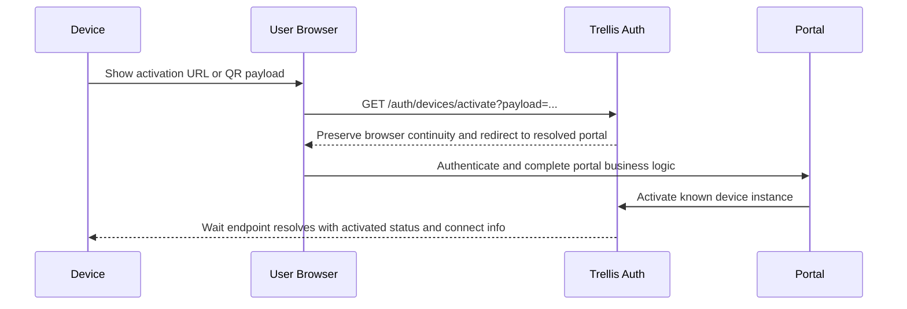

# Design: Device Activation

## Prerequisites

- [trellis-auth.md](./trellis-auth.md) - auth architecture and principal model
- [auth-api.md](./auth-api.md) - auth HTTP and RPC surfaces
- [auth-protocol.md](./auth-protocol.md) - proofs, connect payloads, and pre-auth wait rules
- [../contracts/trellis-contracts-catalog.md](./../contracts/trellis-contracts-catalog.md) - device lineage and allowed-digest rules

## Context

Trellis needs an activation flow for preregistered devices that:

- have their own durable identity
- may be offline during setup
- may have constrained input
- can send an outbound activation URL or QR payload to a phone or browser
- may later gain more product-specific business logic in the portal flow
- use normal Trellis runtime auth with the device identity key once they are online

This design makes `device` the primary architecture term for this activation model.

Key decisions:

- `device` is the primary architecture term for this activation model
- activated devices are preregistered against deployment-owned device profiles
- the client does not choose a flow type or profile during normal activation
- Trellis resolves the device instance, device profile, and activation portal policy from preregistered records
- the activation portal is still a browser web app; if it calls Trellis after login, it does so as the logged-in user rather than as a service
- devices present an exact `contractDigest` at runtime; profiles validate `allowedDigests`
- profiles do not carry a separate rollout-target digest field
- device review is a first-class optional gate controlled by `reviewMode`
- the provisioning/admin path may generate the device root secret locally, but Trellis stores only `publicIdentityKey` plus activation-only secret material rather than the root secret itself

## Design

### 1) Preregistered device instances are the primary path

Known device activation starts from a preregistered instance record.

The expected lifecycle is:

1. an admin or manufacturing/provisioning process provisions the device instance by `publicIdentityKey` and `activationKey`
2. that instance is attached to a device profile
3. a user later activates the device through an authenticated portal flow
4. the activated device reconnects later by asking Trellis for current connect info

Unknown or self-registering devices may be added later as a separate extension. They are not the primary v1 model.

### 2) Device identity is the durable principal

Each activated device is its own Trellis principal.

- the device later authenticates with its own identity key, not as the user who activated it
- the user identity and the device identity are intentionally separate
- any short confirmation code is only a local setup signal; it is never the device's online credential

Each device starts from one root secret:

```text
deviceRootSecret: 32 random bytes
```

The device derives purpose-specific keys with HKDF-SHA256:

```text
identitySeed  = HKDF-SHA256(ikm=deviceRootSecret, salt="", info="trellis/device-identity/v1", L=32)
activationKey = HKDF-SHA256(ikm=deviceRootSecret, salt="", info="trellis/device-activate/v1", L=32)
```

The durable public identity key is:

```text
identityPrivateKey = Ed25519Seed(identitySeed)
publicIdentityKey  = Ed25519Public(identityPrivateKey)
```

Rules:

- `identityPrivateKey` is the real online credential for activated devices
- `activationKey` is used only for QR MACs and optional offline confirmation
- Trellis may store `activationKey` for provisioning-time verification and confirmation-code derivation, but it does not need the device root secret or `identitySeed`
- if Trellis needs a stable instance id, it derives that id from `publicIdentityKey`
- clients do not pass a separate user-chosen instance identifier in the normal path

### 3) Device profiles define rollout and review policy

`DeviceProfile` is a deployment-owned record used during activation and online auth.

```json
{
  "profileId": "reader.default",
  "contractId": "acme.reader@v1",
  "allowedDigests": ["<digest-v1>", "<digest-v2>"],
  "reviewMode": "none",
  "disabled": false
}
```

Rules:

- `profileId` is the stable server-side identifier attached to the device instance and activation record
- `contractId` identifies one contract lineage
- `allowedDigests` may contain multiple active digests in that lineage during rollout
- activated devices present an exact `contractDigest`; auth checks that digest against `allowedDigests`
- `reviewMode: "required"` means portal completion creates or resumes a pending review rather than activating immediately
- there is no separate rollout-target digest field

### 4) Activated devices may not request resources for now

Activated devices are consumer-only for now.

Rules:

- activated-device contracts may use `rpc`, `operations`, `events.subscribe`, and `uses`
- activated-device contracts may not declare `resources`
- activated-device contracts may not rely on installed resource bindings

### 5) Portal resolution is handled by Trellis

The client does not pass `flowType`, `profileId`, or `portalId` in the normal path.

Routing rules:

- app and CLI login flows resolve a portal from explicit deployment-owned login portal selection records keyed by `contractId`, then the deployment login default custom portal when configured, and finally the built-in Trellis login portal
- activated-device flows resolve a portal from explicit deployment-owned device portal selection records keyed by `profileId`, then the deployment device default custom portal when configured, and finally the built-in Trellis device portal

This is automatic resolution in the sense that callers do not choose the portal explicitly. It is still explicit on the server side because Trellis relies on stored portal, login-selection, device-selection, and device-profile records plus the built-in Trellis fallback.

### 6) Known-device activation uses a direct happy path

Known preregistered device activation does not require a requester-visible auth operation in the default path.

Happy path without review:



If portal-side business logic is long-running, the portal may use its own async workflow. That is portal/business-layer behavior rather than a mandatory auth-owned requester operation. If the portal calls Trellis during that workflow, it does so using a normal user-authenticated browser app contract rather than service credentials.

If `reviewMode` is `required`, the activation flow inserts an auth-owned pending-review step:

- `Auth.ActivateDevice` creates or resumes a review record instead of activating immediately
- auth emits a device-review-requested event for reviewer automation
- a service or privileged user with `device.review` or `admin` decides the review through auth RPCs
- the built-in portal and custom portals poll activation status until it becomes `activated` or `rejected`

### 7) Device records

The flow uses four durable record families plus one auth-owned secret record.

`DeviceActivationHandoff` preserves QR context across login or account creation.

```json
{
  "handoffId": "dah_...",
  "instanceId": "dev_...",
  "publicIdentityKey": "<base64url>",
  "nonce": "<base64url>",
  "qrMac": "<base64url>",
  "createdAt": "2026-04-05T12:00:00Z",
  "expiresAt": "2026-04-05T12:30:00Z"
}
```

`DeviceInstance` is the preregistered known device record.

```json
{
  "instanceId": "dev_...",
  "publicIdentityKey": "<base64url>",
  "profileId": "reader.default",
  "metadata": {
    "name": "Front Desk Reader",
    "serialNumber": "SN-123",
    "modelNumber": "MX-10",
    "assetTag": "asset-42"
  },
  "state": "registered",
  "createdAt": "2026-04-05T11:00:00Z",
  "activatedAt": null,
  "revokedAt": null
}
```

Rules:

- `metadata` is optional operator-provided string metadata for CLI and console experiences
- Trellis understands `name`, `serialNumber`, and `modelNumber` for default admin display, but the map may also include deployment-specific opaque keys
- auth, activation, and connect-info decisions do not depend on this metadata

`DeviceProvisioningSecret` is the auth-owned activation secret material keyed by `instanceId`.

```json
{
  "instanceId": "dev_...",
  "activationKey": "<base64url>",
  "createdAt": "2026-04-05T11:00:00Z"
}
```

`DeviceActivationReview` tracks optional gated review.

```json
{
  "reviewId": "dar_...",
  "handoffId": "dah_...",
  "instanceId": "dev_...",
  "publicIdentityKey": "<base64url>",
  "profileId": "reader.default",
  "state": "pending",
  "requestedAt": "2026-04-05T12:03:00Z",
  "decidedAt": null,
  "reason": null
}
```

`DeviceActivationRecord` is the final auth decision for that instance once activation is granted.
It also keeps the activating user identity when the device was activated through a browser or review flow so `Auth.Me` can surface that user later.

```json
{
  "instanceId": "dev_...",
  "publicIdentityKey": "<base64url>",
  "profileId": "reader.default",
  "activatedBy": {
    "origin": "github",
    "id": "123"
  },
  "state": "activated",
  "activatedAt": "2026-04-05T12:08:00Z",
  "revokedAt": null
}
```

### 8) Outbound activation payload

The QR payload is the outbound handoff from device to user.

```json
{
  "v": 1,
  "publicIdentityKey": "<base64url>",
  "nonce": "<base64url>",
  "qrMac": "<base64url>"
}
```

Rules:

- Trellis derives `instanceId` from `publicIdentityKey`
- the payload does not need caller-provided type or instance identifiers
- the QR MAC prevents tampering between the device and the browser flow
- Trellis verifies `qrMac` using the stored `activationKey` before creating a handoff

### 9) Online wait and optional offline confirmation

Before a device is activated it cannot use normal authenticated RPCs, but an online device may still wait for activation completion by calling the auth wait endpoint with an identity-key proof.

Response model:

```ts
type WaitForDeviceActivationResponse =
  | { status: "pending" }
  | {
      status: "activated";
      activatedAt: string;
      confirmationCode?: string;
      connectInfo: DeviceConnectInfo;
    }
  | {
      status: "rejected";
      reason?: string;
    };
```

Rules:

- online devices use the wait endpoint to learn that activation completed
- offline devices may receive a confirmation code from the portal flow out of band and verify it locally with `activationKey`
- when activation completes, Trellis derives the same confirmation code from the stored `activationKey` and may return or display it even for online flows
- local confirmation is separate from later online Trellis auth

### 10) Connect info is server-provided

Activated devices need current runtime connect information from Trellis both:

- immediately after activation completes
- on later startups when activation is already complete and the device wants to reconnect directly

Recommended shared envelope:

```ts
type DeviceConnectInfo = {
  instanceId: string;
  profileId: string;
  contractId: string;
  contractDigest: string;
  transport: {
    natsServers: string[];
    sentinel: {
      jwt: string;
      seed: string;
    };
  };
  auth: {
    mode: "device_identity";
    iatSkewSeconds: number;
  };
};
```

Rules:

- Trellis returns `natsServers` and sentinel credentials from deployment state
- devices should refresh connect info on startup rather than treating previously returned transport data as a permanent source of truth
- local persistence should store the root secret and activation state, not hard-coded NATS topology

### 11) Runtime auth presents an exact digest

Normal runtime auth still happens later, after local confirmation succeeds or the online wait endpoint returns `activated`.

At connect time the activated device presents:

- identity-key proof
- exact `contractDigest`

Auth validates:

1. the known device instance by public identity key
2. activation state is `activated`
3. the device profile is present and enabled
4. `contractDigest` is included in `profile.allowedDigests`

This lets old and new device digests coexist during rollout while keeping validation explicit.

## Client library boundary

Normal device, portal, and admin code SHOULD use Trellis client-library helpers for the mechanical parts of device activation.

### TypeScript helper surface

The TypeScript helper split is:

- low-level device activation helpers in `@qlever-llc/trellis/auth`
- portal and admin RPC wrappers in `@qlever-llc/trellis/auth`
- the intended high-level device runtime entrypoint in `@qlever-llc/trellis`

```ts
type DeviceIdentity = {
  identitySeed: Uint8Array;
  identitySeedBase64url: string;
  publicIdentityKey: string;
  activationKey: Uint8Array;
  activationKeyBase64url: string;
};

declare function deriveDeviceIdentity(
  deviceRootSecret: Uint8Array,
): Promise<DeviceIdentity>;

declare function buildDeviceActivationPayload(args: {
  activationKey: Uint8Array | string;
  publicIdentityKey: string;
  nonce: string;
}): Promise<DeviceActivationPayload>;

declare function encodeDeviceActivationPayload(
  payload: DeviceActivationPayload,
): string;

declare function parseDeviceActivationPayload(
  payload: string,
): DeviceActivationPayload;

declare function buildDeviceActivationUrl(args: {
  trellisUrl: string;
  payload: DeviceActivationPayload | string;
}): string;

declare function signDeviceWaitRequest(args: {
  publicIdentityKey: string;
  nonce: string;
  identitySeed: Uint8Array | string;
  contractDigest?: string;
  iat?: number;
}): Promise<DeviceActivationWaitRequest>;

declare function waitForDeviceActivation(args: {
  trellisUrl: string;
  publicIdentityKey: string;
  nonce: string;
  identitySeed: Uint8Array | string;
  contractDigest: string;
  signal?: AbortSignal;
  pollIntervalMs?: number;
}): Promise<{
  status: "activated";
  activatedAt: string;
  confirmationCode?: string;
  connectInfo: DeviceConnectInfo;
}>;

declare function getDeviceConnectInfo(args: {
  trellisUrl: string;
  publicIdentityKey: string;
  identitySeed: Uint8Array | string;
  contractDigest: string;
  iat?: number;
}): Promise<{ status: "ready"; connectInfo: DeviceConnectInfo }>;

declare function deriveDeviceConfirmationCode(args: {
  activationKey: Uint8Array | string;
  publicIdentityKey: string;
  nonce: string;
}): Promise<string>;

declare function verifyDeviceConfirmationCode(args: {
  activationKey: Uint8Array | string;
  publicIdentityKey: string;
  nonce: string;
  confirmationCode: string;
}): Promise<boolean>;

declare function createDeviceActivationClient(client: {
  requestOrThrow(method: string, input: unknown, opts?: unknown): Promise<unknown>;
}): {
  activateDevice(input: { handoffId: string }): Promise<
    | {
        status: "activated";
        instanceId: string;
        profileId: string;
        activatedAt: string;
        confirmationCode?: string;
      }
    | {
        status: "pending_review";
        reviewId: string;
        instanceId: string;
        profileId: string;
        requestedAt: string;
      }
    | {
        status: "rejected";
        reason?: string;
      }
  >;
  getDeviceActivationStatus(input: { handoffId: string }): Promise<
    | {
        status: "activated";
        instanceId: string;
        profileId: string;
        activatedAt: string;
        confirmationCode?: string;
      }
    | {
        status: "pending_review";
        reviewId: string;
        instanceId: string;
        profileId: string;
        requestedAt: string;
      }
    | {
        status: "rejected";
        reason?: string;
      }
  >;
  listDeviceActivations(input?: {
    instanceId?: string;
    profileId?: string;
    state?: "activated" | "revoked";
  }): Promise<{
    activations: Array<{
      instanceId: string;
      publicIdentityKey: string;
      profileId: string;
      state: "activated" | "revoked";
      activatedAt: string;
      revokedAt: string | null;
    }>;
  }>;
  revokeDeviceActivation(input: { instanceId: string }): Promise<{ success: boolean }>;
  getDeviceConnectInfo(input: {
    publicIdentityKey: string;
    contractDigest: string;
    iat: number;
    sig: string;
  }): Promise<{ status: "ready"; connectInfo: DeviceConnectInfo }>;
};

type DeviceActivationController = {
  url: string;
  waitForOnlineApproval(opts?: { signal?: AbortSignal }): Promise<void>;
  acceptConfirmationCode(code: string): Promise<void>;
};

declare class TrellisDevice {
  static connect<TApi extends TrellisAPI>(args: {
    trellisUrl: string;
    contract: {
      CONTRACT_ID: string;
      CONTRACT_DIGEST: string;
      API: { trellis: TApi };
    };
    rootSecret: Uint8Array | string;
    onActivationRequired?(activation: DeviceActivationController): Promise<void>;
  }): Promise<Trellis<TApi>>;
}
```

Rules:

- device-side code SHOULD treat `deriveDeviceIdentity(...)` as the root helper and persist only the device root secret plus local activation state
- `buildDeviceActivationUrl(...)` always targets Trellis at `GET /auth/devices/activate`; callers do not choose a portal URL directly
- `waitForDeviceActivation(...)` polls the auth wait endpoint and returns once activation is ready
- if the wait endpoint returns `{ status: "rejected" }`, `waitForDeviceActivation(...)` throws rather than returning a rejected union branch to the caller
- `getDeviceConnectInfo(...)` signs a connect-info proof using the device identity and returns the auth-owned `{ status: "ready", connectInfo }` envelope
- portal and admin browser apps SHOULD prefer `createDeviceActivationClient(...)` over manually spelling auth RPC method names
- device activation helpers own proof construction and payload encoding; app code should not reimplement those byte layouts locally
- `TrellisDevice.connect(...)` SHOULD mirror the service-style "connect and return a ready runtime" pattern rather than forcing application code to orchestrate the full activation state machine itself
- `TrellisDevice.connect(...)` accepts `rootSecret` directly as bytes or a string form; it does not generate or persist secrets on behalf of the application
- `TrellisDevice.connect(...)` SHOULD fetch current connect info on startup rather than persisting transport details across restarts
- `onActivationRequired(...)` is the integration hook for local displays, local web UIs, CLIs, and other device-local activation UX

Those helpers SHOULD own:

- deriving the identity seed, public identity key, and activation key from the device root secret
- building and parsing the activation payload
- signing wait requests and polling until activation resolves
- deriving and verifying the short confirmation code when used
- fetching and refreshing `DeviceConnectInfo`
- wrapping the low-level HTTP and RPC surfaces into small typed convenience methods

Application code SHOULD still own:

- secure storage of the device root secret
- device-local UX such as serving or rendering the activation URL / QR
- reviewer automation and decision policy when `reviewMode` is enabled
- portal-side business logic and optional review policy

The wire protocol remains public and stable as an escape hatch, but it is not the preferred normal integration surface.
