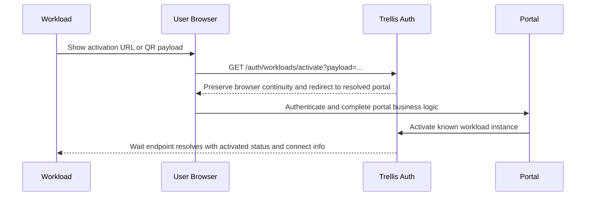

# Design: Workload Activation

## Prerequisites

- [trellis-auth.md](./trellis-auth.md) - auth architecture and principal model
- [auth-api.md](./auth-api.md) - auth HTTP and RPC surfaces
- [auth-protocol.md](./auth-protocol.md) - proofs, connect payloads, and pre-auth wait rules
- [../contracts/trellis-contracts-catalog.md](./../contracts/trellis-contracts-catalog.md) - workload lineage and allowed-digest rules

## Context

Trellis needs an activation flow for preregistered workloads that:

- have their own durable identity
- may be offline during setup
- may have constrained input
- can send an outbound activation URL or QR payload to a phone or browser
- may later gain more product-specific business logic in the portal flow
- use normal Trellis runtime auth with the workload identity key once they are online

This design replaces the earlier device-specific model with a more general workload activation model.

Key decisions:

- `device` is no longer the primary architecture term; the auth model uses `user` and `workload`
- activated workloads are preregistered against deployment-owned workload profiles
- the client does not choose a flow type or profile during normal activation
- Trellis resolves the workload instance, workload profile, and activation portal policy from preregistered records
- the activation portal is still a browser web app; if it calls Trellis after login, it does so as the logged-in user rather than as a service
- workloads present an exact `contractDigest` at runtime; profiles validate `allowedDigests`
- profiles do not carry a separate rollout-target digest field
- workload review is a first-class optional gate controlled by `reviewMode`
- the provisioning/admin path may generate the workload root secret locally, but Trellis stores only `publicIdentityKey` plus activation-only secret material rather than the root secret itself

## Design

### 1) Preregistered workload instances are the primary path

Known workload activation starts from a preregistered instance record.

The expected lifecycle is:

1. an admin or manufacturing/provisioning process provisions the workload instance by `publicIdentityKey` and `activationKey`
2. that instance is attached to a workload profile
3. a user later activates the workload through an authenticated portal flow
4. the activated workload reconnects later by asking Trellis for current connect info

Unknown or self-registering workloads may be added later as a separate extension. They are not the primary v1 model.

### 2) Workload identity is the durable principal

Each activated workload is its own Trellis principal.

- the workload later authenticates with its own identity key, not as the user who activated it
- the user identity and the workload identity are intentionally separate
- any short confirmation code is only a local setup signal; it is never the workload's online credential

Each workload starts from one root secret:

```text
workloadRootSecret: 32 random bytes
```

The workload derives purpose-specific keys with HKDF-SHA256:

```text
identitySeed  = HKDF-SHA256(ikm=workloadRootSecret, salt="", info="trellis/workload-identity/v1", L=32)
activationKey = HKDF-SHA256(ikm=workloadRootSecret, salt="", info="trellis/workload-activate/v1", L=32)
```

The durable public identity key is:

```text
identityPrivateKey = Ed25519Seed(identitySeed)
publicIdentityKey  = Ed25519Public(identityPrivateKey)
```

Rules:

- `identityPrivateKey` is the real online credential for activated workloads
- `activationKey` is used only for QR MACs and optional offline confirmation
- Trellis may store `activationKey` for provisioning-time verification and confirmation-code derivation, but it does not need the workload root secret or `identitySeed`
- if Trellis needs a stable instance id, it derives that id from `publicIdentityKey`
- clients do not pass a separate user-chosen instance identifier in the normal path

### 3) Workload profiles define rollout and review policy

`WorkloadProfile` is a deployment-owned record used during activation and online auth.

```json
{
  "profileId": "reader.default",
  "contractId": "acme.reader@v1",
  "allowedDigests": ["<digest-v1>", "<digest-v2>"],
  "reviewMode": "none",
  "disabled": false
}
```

Rules:

- `profileId` is the stable server-side identifier attached to the workload instance and activation record
- `contractId` identifies one contract lineage
- `allowedDigests` may contain multiple active digests in that lineage during rollout
- activated workloads present an exact `contractDigest`; auth checks that digest against `allowedDigests`
- `reviewMode: "required"` means portal completion creates or resumes a pending review rather than activating immediately
- there is no separate rollout-target digest field

### 4) Activated workloads may not request resources for now

Activated workloads are consumer-only for now.

Rules:

- activated-workload contracts may use `rpc`, `operations`, `events.subscribe`, and `uses`
- activated-workload contracts may not declare `resources`
- activated-workload contracts may not rely on installed resource bindings

### 5) Portal resolution is handled by Trellis

The client does not pass `flowType`, `profileId`, or `portalId` in the normal path.

Routing rules:

- app and CLI login flows resolve a portal from explicit deployment-owned login portal selection records keyed by `contractId`, then the deployment login default custom portal when configured, and finally the built-in Trellis login portal
- activated-workload flows resolve a portal from explicit deployment-owned workload portal selection records keyed by `profileId`, then the deployment workload default custom portal when configured, and finally the built-in Trellis workload portal

This is automatic resolution in the sense that callers do not choose the portal explicitly. It is still explicit on the server side because Trellis relies on stored portal, login-selection, workload-selection, and workload-profile records plus the built-in Trellis fallback.

### 6) Known-workload activation uses a direct happy path

Known preregistered workload activation does not require a requester-visible auth operation in the default path.

Happy path without review:



If portal-side business logic is long-running, the portal may use its own async workflow. That is portal/business-layer behavior rather than a mandatory auth-owned requester operation. If the portal calls Trellis during that workflow, it does so using a normal user-authenticated browser app contract rather than service credentials.

If `reviewMode` is `required`, the activation flow inserts an auth-owned pending-review step:

- `Auth.ActivateWorkload` creates or resumes a review record instead of activating immediately
- auth emits a workload-review-requested event for reviewer automation
- a service or privileged user with `workload.review` or `admin` decides the review through auth RPCs
- the built-in portal and custom portals poll activation status until it becomes `activated` or `rejected`

### 7) Workload records

The flow uses four durable record families plus one auth-owned secret record.

`WorkloadActivationHandoff` preserves QR context across login or account creation.

```json
{
  "handoffId": "wah_...",
  "instanceId": "wrk_...",
  "publicIdentityKey": "<base64url>",
  "nonce": "<base64url>",
  "qrMac": "<base64url>",
  "createdAt": "2026-04-05T12:00:00Z",
  "expiresAt": "2026-04-05T12:30:00Z"
}
```

`WorkloadInstance` is the preregistered known workload record.

```json
{
  "instanceId": "wrk_...",
  "publicIdentityKey": "<base64url>",
  "profileId": "reader.default",
  "state": "registered",
  "createdAt": "2026-04-05T11:00:00Z",
  "activatedAt": null,
  "revokedAt": null
}
```

`WorkloadProvisioningSecret` is the auth-owned activation secret material keyed by `instanceId`.

```json
{
  "instanceId": "wrk_...",
  "activationKey": "<base64url>",
  "createdAt": "2026-04-05T11:00:00Z"
}
```

`WorkloadActivationReview` tracks optional gated review.

```json
{
  "reviewId": "war_...",
  "handoffId": "wah_...",
  "instanceId": "wrk_...",
  "publicIdentityKey": "<base64url>",
  "profileId": "reader.default",
  "state": "pending",
  "requestedAt": "2026-04-05T12:03:00Z",
  "decidedAt": null,
  "reason": null
}
```

`WorkloadActivationRecord` is the final auth decision for that instance once activation is granted.
It also keeps the activating user identity when the workload was activated through a browser or review flow so `Auth.Me` can surface that user later.

```json
{
  "instanceId": "wrk_...",
  "publicIdentityKey": "<base64url>",
  "profileId": "reader.default",
  "activatedBy": {
    "origin": "github",
    "id": "123"
  },
  "state": "activated",
  "activatedAt": "2026-04-05T12:08:00Z",
  "revokedAt": null
}
```

### 8) Outbound activation payload

The QR payload is the outbound handoff from workload to user.

```json
{
  "v": 1,
  "publicIdentityKey": "<base64url>",
  "nonce": "<base64url>",
  "qrMac": "<base64url>"
}
```

Rules:

- Trellis derives `instanceId` from `publicIdentityKey`
- the payload does not need caller-provided type or instance identifiers
- the QR MAC prevents tampering between the workload and the browser flow
- Trellis verifies `qrMac` using the stored `activationKey` before creating a handoff

### 9) Online wait and optional offline confirmation

Before a workload is activated it cannot use normal authenticated RPCs, but an online workload may still wait for activation completion by calling the auth wait endpoint with an identity-key proof.

Response model:

```ts
type WaitForWorkloadActivationResponse =
  | { status: "pending" }
  | {
      status: "activated";
      activatedAt: string;
      confirmationCode?: string;
      connectInfo: WorkloadConnectInfo;
    }
  | {
      status: "rejected";
      reason?: string;
    };
```

Rules:

- online workloads use the wait endpoint to learn that activation completed
- offline workloads may receive a confirmation code from the portal flow out of band and verify it locally with `activationKey`
- when activation completes, Trellis derives the same confirmation code from the stored `activationKey` and may return or display it even for online flows
- local confirmation is separate from later online Trellis auth

### 10) Connect info is server-provided

Activated workloads need current runtime connect information from Trellis both:

- immediately after activation completes
- on later startups when activation is already complete and the workload wants to reconnect directly

Recommended shared envelope:

```ts
type WorkloadConnectInfo = {
  instanceId: string;
  profileId: string;
  contractId: string;
  contractDigest: string;
  transport: {
    natsServers: string[];
    sentinel: {
      jwt: string;
      seed: string;
    };
  };
  auth: {
    mode: "workload_identity";
    iatSkewSeconds: number;
  };
};
```

Rules:

- Trellis returns `natsServers` and sentinel credentials from deployment state
- workloads should refresh connect info on startup rather than treating previously returned transport data as a permanent source of truth
- local persistence should store the root secret and activation state, not hard-coded NATS topology

### 11) Runtime auth presents an exact digest

Normal runtime auth still happens later, after local confirmation succeeds or the online wait endpoint returns `activated`.

At connect time the activated workload presents:

- identity-key proof
- exact `contractDigest`

Auth validates:

1. the known workload instance by public identity key
2. activation state is `activated`
3. the workload profile is present and enabled
4. `contractDigest` is included in `profile.allowedDigests`

This lets old and new workload digests coexist during rollout while keeping validation explicit.

## Client library boundary

Normal workload, portal, and admin code SHOULD use Trellis client-library helpers for the mechanical parts of workload activation.

### TypeScript helper surface

The TypeScript helper split is:

- low-level workload activation helpers in `@qlever-llc/trellis/auth`
- portal and admin RPC wrappers in `@qlever-llc/trellis/auth`
- the intended high-level workload runtime entrypoint in `@qlever-llc/trellis`

```ts
type WorkloadIdentity = {
  identitySeed: Uint8Array;
  identitySeedBase64url: string;
  publicIdentityKey: string;
  activationKey: Uint8Array;
  activationKeyBase64url: string;
};

declare function deriveWorkloadIdentity(
  workloadRootSecret: Uint8Array,
): Promise<WorkloadIdentity>;

declare function buildWorkloadActivationPayload(args: {
  activationKey: Uint8Array | string;
  publicIdentityKey: string;
  nonce: string;
}): Promise<WorkloadActivationPayload>;

declare function encodeWorkloadActivationPayload(
  payload: WorkloadActivationPayload,
): string;

declare function parseWorkloadActivationPayload(
  payload: string,
): WorkloadActivationPayload;

declare function buildWorkloadActivationUrl(args: {
  trellisUrl: string;
  payload: WorkloadActivationPayload | string;
}): string;

declare function signWorkloadWaitRequest(args: {
  publicIdentityKey: string;
  nonce: string;
  identitySeed: Uint8Array | string;
  contractDigest?: string;
  iat?: number;
}): Promise<WorkloadActivationWaitRequest>;

declare function waitForWorkloadActivation(args: {
  trellisUrl: string;
  publicIdentityKey: string;
  nonce: string;
  identitySeed: Uint8Array | string;
  contractDigest: string;
  signal?: AbortSignal;
  pollIntervalMs?: number;
}): Promise<{
  status: "activated";
  activatedAt: string;
  confirmationCode?: string;
  connectInfo: WorkloadConnectInfo;
}>;

declare function getWorkloadConnectInfo(args: {
  trellisUrl: string;
  publicIdentityKey: string;
  identitySeed: Uint8Array | string;
  contractDigest: string;
  iat?: number;
}): Promise<{ status: "ready"; connectInfo: WorkloadConnectInfo }>;

declare function deriveWorkloadConfirmationCode(args: {
  activationKey: Uint8Array | string;
  publicIdentityKey: string;
  nonce: string;
}): Promise<string>;

declare function verifyWorkloadConfirmationCode(args: {
  activationKey: Uint8Array | string;
  publicIdentityKey: string;
  nonce: string;
  confirmationCode: string;
}): Promise<boolean>;

declare function createWorkloadActivationClient(client: {
  requestOrThrow(method: string, input: unknown, opts?: unknown): Promise<unknown>;
}): {
  activateWorkload(input: { handoffId: string }): Promise<
    | {
        status: "activated";
        instanceId: string;
        profileId: string;
        activatedAt: string;
        confirmationCode?: string;
      }
    | {
        status: "pending_review";
        reviewId: string;
        instanceId: string;
        profileId: string;
        requestedAt: string;
      }
    | {
        status: "rejected";
        reason?: string;
      }
  >;
  getWorkloadActivationStatus(input: { handoffId: string }): Promise<
    | {
        status: "activated";
        instanceId: string;
        profileId: string;
        activatedAt: string;
        confirmationCode?: string;
      }
    | {
        status: "pending_review";
        reviewId: string;
        instanceId: string;
        profileId: string;
        requestedAt: string;
      }
    | {
        status: "rejected";
        reason?: string;
      }
  >;
  listWorkloadActivations(input?: {
    instanceId?: string;
    profileId?: string;
    state?: "activated" | "revoked";
  }): Promise<{
    activations: Array<{
      instanceId: string;
      publicIdentityKey: string;
      profileId: string;
      state: "activated" | "revoked";
      activatedAt: string;
      revokedAt: string | null;
    }>;
  }>;
  revokeWorkloadActivation(input: { instanceId: string }): Promise<{ success: boolean }>;
  getWorkloadConnectInfo(input: {
    publicIdentityKey: string;
    contractDigest: string;
    iat: number;
    sig: string;
  }): Promise<{ status: "ready"; connectInfo: WorkloadConnectInfo }>;
};

type WorkloadActivationController = {
  url: string;
  waitForOnlineApproval(opts?: { signal?: AbortSignal }): Promise<void>;
  acceptConfirmationCode(code: string): Promise<void>;
};

declare class TrellisWorkload {
  static connect<TApi extends TrellisAPI>(args: {
    trellisUrl: string;
    contract: {
      CONTRACT_ID: string;
      CONTRACT_DIGEST: string;
      API: { trellis: TApi };
    };
    rootSecret: Uint8Array | string;
    onActivationRequired?(activation: WorkloadActivationController): Promise<void>;
  }): Promise<Trellis<TApi>>;
}
```

Rules:

- workload-side code SHOULD treat `deriveWorkloadIdentity(...)` as the root helper and persist only the workload root secret plus local activation state
- `buildWorkloadActivationUrl(...)` always targets Trellis at `GET /auth/workloads/activate`; callers do not choose a portal URL directly
- `waitForWorkloadActivation(...)` polls the auth wait endpoint and returns once activation is ready
- if the wait endpoint returns `{ status: "rejected" }`, `waitForWorkloadActivation(...)` throws rather than returning a rejected union branch to the caller
- `getWorkloadConnectInfo(...)` signs a connect-info proof using the workload identity and returns the auth-owned `{ status: "ready", connectInfo }` envelope
- portal and admin browser apps SHOULD prefer `createWorkloadActivationClient(...)` over manually spelling auth RPC method names
- workload activation helpers own proof construction and payload encoding; app code should not reimplement those byte layouts locally
- `TrellisWorkload.connect(...)` SHOULD mirror the service-style "connect and return a ready runtime" pattern rather than forcing application code to orchestrate the full activation state machine itself
- `TrellisWorkload.connect(...)` accepts `rootSecret` directly as bytes or a string form; it does not generate or persist secrets on behalf of the application
- `TrellisWorkload.connect(...)` SHOULD fetch current connect info on startup rather than persisting transport details across restarts
- `onActivationRequired(...)` is the integration hook for local displays, local web UIs, CLIs, and other workload-local activation UX

Those helpers SHOULD own:

- deriving the identity seed, public identity key, and activation key from the workload root secret
- building and parsing the activation payload
- signing wait requests and polling until activation resolves
- deriving and verifying the short confirmation code when used
- fetching and refreshing `WorkloadConnectInfo`
- wrapping the low-level HTTP and RPC surfaces into small typed convenience methods

Application code SHOULD still own:

- secure storage of the workload root secret
- workload-local UX such as serving or rendering the activation URL / QR
- reviewer automation and decision policy when `reviewMode` is enabled
- portal-side business logic and optional review policy

The wire protocol remains public and stable as an escape hatch, but it is not the preferred normal integration surface.
