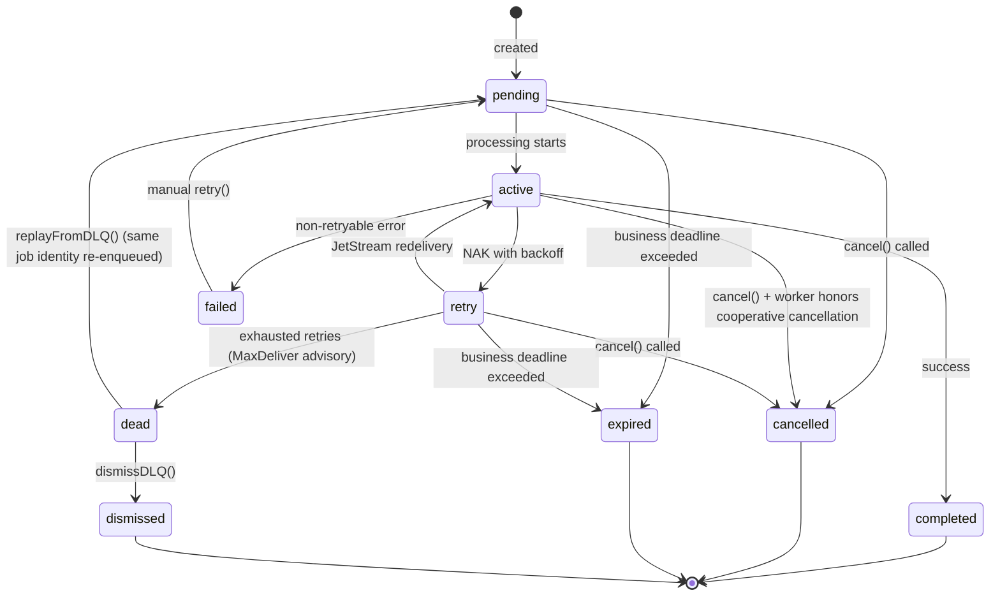

# Design: Trellis Job Management

## Prerequisites

- [../core/service-development.md](./../core/service-development.md) -
  service-author patterns and jobs vs operations boundary
- [../core/type-system-patterns.md](./../core/type-system-patterns.md) - Result,
  error, and weak-type guidance

## Context

Services need a means of:

- Running service-private background work
- Handling retries of failed work with backoff
- Projecting execution status for observability and admin tooling
- Recording internal progress for workflows that may also back caller-visible
  operations
- Allowing operators to query jobs across all services

Trellis services should follow the companion cross-cutting pattern docs
referenced above.

## Design

This document defines the Trellis jobs subsystem and its public language
surfaces:

- a service-local jobs surface for services to create and process their own jobs
- an admin jobs surface for operators to query and manage jobs across all
  services

Exact TypeScript helper signatures, Rust method signatures, generated item
inventories, SDK imports, and client member lists belong in the generated API
reference and Rustdoc under `/api`. This document defines the subsystem
invariants those APIs must preserve.

In TypeScript, the service-local runtime surface lives in `@qlever-llc/trellis`
and the standard Trellis Jobs admin RPC contract lives in
`@qlever-llc/trellis/sdk/jobs`:

- service-local jobs are exposed on connected service runtimes as `service.jobs`
- admin and operator jobs access uses the centralized `Jobs.*` RPC surface,
  typically through generated jobs SDK types or client wrappers

This document also defines the shared Trellis-owned jobs infrastructure plus a
separate Jobs admin runtime implementation for admin queries, janitor, and SQL
projection. The `trellis.jobs@v1` contract is a built-in Trellis API; it is not
owned by that runtime implementation.

Caller-visible asynchronous APIs are defined separately in
[../operations/trellis-operations.md](./../operations/trellis-operations.md).
Jobs remain service-private execution machinery.

The shared streams used by jobs are Trellis-owned runtime infrastructure.
Trellis provisions or binds those resources during service envelope expansion for
jobs-enabled services. The Jobs admin runtime may host the built-in
`trellis.jobs@v1` RPCs, but it does not own or control the contract. Ordinary
services and demos should not need an extra manual `trellis.jobs@v1` install
step just to create or process jobs.

### Design Principles

1. **Stream-first architecture** — The `JOBS` JetStream stream is the source of
   truth. SQL is a disposable derived projection for queries and admin actions.
2. **Jobs admin runtime** — Implements janitor, global RPC handlers, and SQL
   projection for the built-in Jobs API. Runtime replicas may share the same
   projection database or run with one owner for projector/janitor/advisory
   loops plus RPC-only replicas.
3. **Service-local processing** — Each service processes its own jobs via its
   own consumer.
4. **Passive worker heartbeats** — Workers emit per-job-type heartbeat subjects
   for observability; any admin registry is a derived projection, not part of
   job correctness.
5. **Stream-driven observability** — Job state changes and worker heartbeats
   publish messages to the jobs subsystem stream space (these are not
   `events.v1.*` domain events).

### Job States

| State       | Description                                          |
| ----------- | ---------------------------------------------------- |
| `pending`   | Job created, waiting to be processed                 |
| `active`    | Currently being processed                            |
| `retry`     | NAK sent, awaiting JetStream redelivery              |
| `completed` | Successfully finished                                |
| `failed`    | Processing failed, can be manually retried           |
| `cancelled` | Cancelled before completion (terminal)               |
| `expired`   | Exceeded business deadline (terminal)                |
| `dead`      | Moved to DLQ, awaiting admin replay or dismissal     |
| `dismissed` | Explicitly dismissed from DLQ by an admin (terminal) |

**State transitions:**



**Cancellation semantics:**

- `pending`/`retry`: Immediate cancellation (job never processed or won't be
  retried)
- `active`: Best-effort and cooperative. Language runtimes may expose different
  cancellation primitives to handlers, but the worker-facing semantic is the
  same: cancellation should be observed cooperatively by in-flight work.
- Worker-host shutdown is distinct from business cancellation. Shutdown should
  interrupt processing and requeue work rather than publishing a normal
  `cancelled` outcome.
- Execution-terminal states (`completed`, `failed`, `cancelled`, `expired`,
  `dead`, `dismissed`): No-op for worker processing and cancellation. Explicit
  admin DLQ operations move only `dead` jobs into `pending` or `dismissed`.

### Storage Architecture

**Source of Truth: JetStream Stream (`JOBS`)**

- Stream: `JOBS`
- Subject families:
  - Job lifecycle: `trellis.jobs.<service>.<job-type>.<job-id>.<event>`
  - Worker heartbeats:
    `trellis.jobs.workers.<service>.<job-type>.<instance-id>.heartbeat`
- Message subjects:
  - `trellis.jobs.<service>.<job-type>.<job-id>.created` — includes full payload
  - `trellis.jobs.<service>.<job-type>.<job-id>.started`
  - `trellis.jobs.<service>.<job-type>.<job-id>.retry`
  - `trellis.jobs.<service>.<job-type>.<job-id>.progress`
  - `trellis.jobs.<service>.<job-type>.<job-id>.logged`
  - `trellis.jobs.<service>.<job-type>.<job-id>.completed`
  - `trellis.jobs.<service>.<job-type>.<job-id>.failed`
  - `trellis.jobs.<service>.<job-type>.<job-id>.cancelled`
  - `trellis.jobs.<service>.<job-type>.<job-id>.expired`
  - `trellis.jobs.<service>.<job-type>.<job-id>.retried`
  - `trellis.jobs.<service>.<job-type>.<job-id>.dead`
  - `trellis.jobs.<service>.<job-type>.<job-id>.dismissed`
  - `trellis.jobs.workers.<service>.<job-type>.<instance-id>.heartbeat` —
    passive worker-presence heartbeat
- Retention: Limits-based (configurable)

These subjects are namespaced to the jobs subsystem (`trellis.jobs.*`). They
remain raw pub/sub subjects rather than `events.v1.*` contract events.

**Subject filtering examples:**

| Pattern                                        | Description                                      |
| ---------------------------------------------- | ------------------------------------------------ |
| `trellis.jobs.>`                               | All jobs-subsystem subjects across all services  |
| `trellis.jobs.<service>.>`                     | All lifecycle events for a specific service      |
| `trellis.jobs.<service>.<job-type>.>`          | All lifecycle events for a specific job type     |
| `trellis.jobs.*.*.<job-id>.>`                  | All events for a specific job (any service/type) |
| `trellis.jobs.<service>.<job-type>.<job-id>.>` | All events for a specific job (fully qualified)  |
| `trellis.jobs.*.*.*.completed`                 | All completion events across services            |
| `trellis.jobs.workers.<service>.>`             | All worker heartbeats for a specific service     |
| `trellis.jobs.workers.<service>.<job-type>.>`  | All worker heartbeats for a specific job type    |

Job state changes and worker heartbeats are published to this stream. The stream
is append-only and replayable. The `.created` event contains the full job
payload, enabling stream replay to reconstruct job state.

**Work Queue: JetStream Stream (`JOBS_WORK`)**

- Stream: `JOBS_WORK`
- **Sources from `JOBS`** — automatically populated via stream sourcing (see
  Provisioning Model)
- Subject pattern: `trellis.work.<service>.<job-type>`
- Consumer: Per job-type durable consumer (allows different BackOff/AckWait per
  type)
- Retention: WorkQueue policy

When a service calls `service.jobs.<queue>.create()`, the runtime publishes a
`.created` event to `JOBS`. The `JOBS_WORK` stream is configured to source
`.created` and `.retried` events from `JOBS` with a subject transform,
automatically populating the work queue. This keeps initial enqueue and manual
retry stream-first and replayable.

**Consumer configuration (per job-type):**

```
MaxDeliver: 5
BackOff: 5s, 30s, 2m, 10m, 30m
AckPolicy: Explicit
AckWait: 5m (must exceed expected job duration)
```

**Advisory Stream (`JOBS_ADVISORIES`)**

- Stream: `JOBS_ADVISORIES`
- Subject: `$JS.EVENT.ADVISORY.CONSUMER.MAX_DELIVERIES.JOBS_WORK.>`
- Purpose: Durable capture of max-delivery advisories for reliable failure
  detection

When a work message exhausts `MaxDeliver`, NATS emits an advisory. By capturing
these in a stream, the `jobs` service can reliably detect exhausted jobs even if
it was temporarily unavailable.

**Jobs Admin Projection: SQLite**

The shared jobs subsystem stores query state in an internal SQLite projection
owned by the Jobs admin runtime.

- Default path: `/var/lib/trellis/jobs.sqlite`
- Override: `TRELLIS_JOBS_DB_PATH`
- Tables:
  - `jobs_projection` for current job state and query fields
  - `worker_presence_projection` for latest worker heartbeat state
  - `projection_metadata` for projection bookkeeping

The jobs projection is a strict view of the event stream. Job state in SQLite
changes only by projecting job events from `JOBS`; neither the Jobs admin runtime
nor an admin RPC mutates projected job state directly. Admin mutations publish
real lifecycle events and then observe those events through the projection.

Worker presence is also an internal SQL projection. Workers emit passive
heartbeat subjects; the Jobs admin runtime stores the latest heartbeat per
service/job-type/instance and applies freshness filtering at query time.
Ordinary services do not bind to or write any admin projection storage.

### Provisioning Model

Shared jobs infrastructure is Trellis-owned runtime state. Trellis provisions or
binds it during service envelope expansion for jobs-enabled environments rather
than requiring a separate manual jobs install step or first-bootstrap side effect.

- normal services declare top-level `jobs` to participate in jobs processing
  without owning the shared stream topology directly
- Trellis owns the shared streams needed by the jobs subsystem
- a separate jobs admin runtime may still implement centralized queries, janitor
  work, and SQL projections for the built-in Jobs API, but ordinary service-local
  workers do not depend on a manual jobs service deployment to start
- the `trellis` service provisions or binds the shared jobs resources during
  service envelope expansion before jobs-enabled services start
- the `jobs` service and service-local workers create only dynamic per-job-type
  consumers at runtime
- the runtime should consume those bindings, rather than hard-coding an
  imperative infrastructure setup path
- resolved runtime bindings may still include internal work-stream details
  needed by the host runtime, but they do not expose admin projection storage to
  ordinary services. Public service-author APIs should use
  `service.jobs.<queue>.handle(...)`, `service.wait()`, and `JobRef` helpers
  rather than runtime stream bindings directly

This document depends on the contract model in
`../contracts/trellis-contracts-catalog.md` supporting top-level jobs,
binding-driven resource access, and runtime-owned JetStream infrastructure. Jobs
streams and stream source transforms are Trellis-owned runtime details, not
service-declared contract resources.

Normal consuming service contracts should declare top-level `jobs`. The JSON
examples below show the resolved JetStream configuration the jobs runtime expects
after binding. Trellis should provision these shared resources during service
envelope expansion so service-local workers can rely on the bindings without a
separate infrastructure install step.

Trellis jobs require `nats-server` 2.10.0 or newer. This is the runtime floor
for JetStream source subject transforms and filtered consumer create API
permissions; older durable consumer-create subjects are not part of the v1 jobs
permission model.

### Canonical Worker Runtime Flow

All Trellis language runtimes MUST use the same service-local jobs worker flow.
Library-specific JetStream helper behavior is not a runtime contract and must not
add extra permissions or alter worker semantics.

For each bound queue, the connected service runtime MUST:

- validate the resolved queue binding and configured concurrency before starting
  worker tasks
- ensure the per-queue durable consumer directly against the bound `workStream`
  and queue `consumerName` using the NATS 2.10 filtered consumer create API
- avoid preflighting or opening `JOBS_WORK` through stream-info APIs during
  service-local worker startup
- fetch direct consumer info by `workStream` and `consumerName` only as the
  fallback for an existing compatible consumer
- fail worker startup synchronously if the durable consumer cannot be created or
  attached
- consume work messages from the ensured consumer handle
- before processing a work item, read the latest lifecycle event from `JOBS` with
  JetStream direct get by fully qualified lifecycle subject
- ack without processing when the latest lifecycle event is terminal
- subscribe to the queue cancellation subject for live cooperative cancellation

This canonical path is intentionally language-neutral. TypeScript, Rust, and any
future runtime must converge on this flow even when their underlying NATS client
libraries expose different helper APIs.

The service-local jobs permission set therefore includes the concrete subjects
needed for this canonical flow: filtered consumer create/info for the bound work
stream, pull-message and ack subjects for that consumer, direct get on the `JOBS`
stream for lifecycle reads, service-local lifecycle publish/subscribe subjects,
and service-local worker heartbeat subjects. It does not include broad stream
management, `JOBS_WORK` stream-info preflight, or legacy durable-consumer-create
subjects for ordinary services.

Trellis-created Jobs streams use the configured JetStream replica count for the
deployment. Standalone/local NATS deployments should use `1`; production
clustered deployments should normally use `3`. The examples below use `3` to
show the recommended production shape.

Resolved service bindings may still include internal runtime-generated work
stream details such as `JOBS_WORK`, but ordinary service code should treat those
as Trellis internals rather than as public contract-authored stream aliases. Jobs
admin projection storage is internal to the Jobs admin runtime and is not part of
the service-visible jobs binding.

**Stream: `JOBS`**

```json
{
  "name": "JOBS",
  "subjects": ["trellis.jobs.>"],
  "retention": "limits",
  "max_msgs": -1,
  "max_bytes": -1,
  "max_age": 0,
  "storage": "file",
  "num_replicas": 3,
  "discard": "old"
}
```

**Stream: `JOBS_WORK`**

```json
{
  "name": "JOBS_WORK",
  "subjects": ["trellis.work.>"],
  "retention": "workqueue",
  "storage": "file",
  "num_replicas": 3,
  "sources": [
    {
      "name": "JOBS",
      "filter_subject": "trellis.jobs.*.*.*.created",
      "subject_transform_dest": "trellis.work.$1.$2"
    },
    {
      "name": "JOBS",
      "filter_subject": "trellis.jobs.*.*.*.retried",
      "subject_transform_dest": "trellis.work.$1.$2"
    }
  ]
}
```

The `sources` configuration automatically replicates `.created` and `.retried`
events from `JOBS` into `JOBS_WORK` with a subject transform:
`trellis.jobs.<service>.<job-type>.<job-id>.<event>` →
`trellis.work.<service>.<job-type>`.

**Stream: `JOBS_ADVISORIES`**

```json
{
  "name": "JOBS_ADVISORIES",
  "subjects": ["$JS.EVENT.ADVISORY.CONSUMER.MAX_DELIVERIES.JOBS_WORK.>"],
  "retention": "limits",
  "max_age": 604800000000000,
  "storage": "file",
  "num_replicas": 1
}
```

**Consumer: Per job-type (created dynamically)**

Each service creates a durable consumer for its job types:

```json
{
  "durable_name": "<service>-<job-type>",
  "filter_subject": "trellis.work.<service>.<job-type>",
  "ack_policy": "explicit",
  "ack_wait": 300000000000,
  "max_deliver": 5,
  "backoff": [
    5000000000,
    30000000000,
    120000000000,
    600000000000,
    1800000000000
  ]
}
```

**Scaling note:** For v1, the projector uses a single consumer. If horizontal
scaling is needed, NATS `partition()` function enables deterministic
partitioning by job-id for parallel projection while maintaining per-job
ordering.

### Jobs Service

A dedicated `jobs` service provides observability and management. It is **not
required for job processing**—services can create and process jobs
independently. The `jobs` service adds:

1. **SQL Projection** — Consumes `JOBS` stream via durable consumer and updates
   the internal SQLite query projection
2. **Worker Presence Projection** — Passively consumes worker heartbeat subjects
   and derives admin-facing live-worker views in SQLite
3. **Janitor** — Enforces business `deadline` expiry (not AckWait—JetStream
   handles redelivery)
4. **Advisory Consumer** — Consumes `JOBS_ADVISORIES` and maps exhausted
   deliveries to `.dead`
5. **Global RPCs** — ListServices, ListJobs, GetJob, Cancel, Retry, DLQ
   management

The jobs admin runtime is stateless with respect to source-of-truth job state.
If it's unavailable, job processing continues normally; only UI visibility and
deadline enforcement pause until it recovers and rebuilds or catches up the SQL
projection.

### Worker Heartbeats

Workers may publish passive heartbeat events per service instance and job type:

```typescript
type WorkerHeartbeat = {
  service: string;
  jobType: string;
  instanceId: string;
  concurrency?: number;
  version?: string;
  timestamp: string;
};
```

**Subject:** `trellis.jobs.workers.<service>.<job-type>.<instance-id>.heartbeat`

- Heartbeats are a sibling subject family inside the jobs subsystem, distinct
  from per-job lifecycle subjects.
- Emitting heartbeats is optional for job correctness. Jobs continue to run even
  if heartbeats are absent or the `jobs` service is not deployed.
- The Jobs admin runtime projects heartbeats into a durable, freshness-filtered
  live-worker view for admin screens and service summaries.
- `listServices()` and related admin views aggregate that derived
  worker-presence projection rather than reading direct service-written registry
  state.

### Job Schema

```typescript
type JobWire = {
  id: string;
  service: string;
  type: string;
  state: JobState;

  payload: unknown;
  result?: unknown;

  createdAt: string;
  updatedAt: string;
  startedAt?: string;
  completedAt?: string;

  tries: number;
  maxTries: number;
  lastError?: string;

  deadline?: string;

  progress?: {
    step?: string;
    message?: string;
    current?: number;
    total?: number;
  };

  logs?: JobLogEntry[];
};

type JobLogEntry = {
  timestamp: string;
  level: "info" | "warn" | "error";
  message: string;
};

type JobState =
  | "pending"
  | "active"
  | "retry"
  | "completed"
  | "failed"
  | "cancelled"
  | "expired"
  | "dead"
  | "dismissed";
```

`unknown` in this schema is a wire-model concern, not the intended public
service-author API. Public Rust and TypeScript jobs APIs MUST expose typed
per-job-type handles and MUST NOT require callers to work directly with
`unknown`, `any`, or `serde_json::Value` for normal job creation or handling.

### Lifecycle Events

Job state changes are published to the `JOBS` stream:

**Subject:** `trellis.jobs.<service>.<job-type>.<job-id>.<event-type>`

**Event types:**

- `created` — Job enqueued (includes full payload for stream reconstruction)
- `started` — Processing began
- `retry` — Worker requested redelivery via NAK/backoff
- `progress` — Progress update (structured: step/message/current/total, all
  optional)
- `logged` — Log entry added (contains only new entries; the SQL projection
  aggregates the current log view)
- `completed` — Successfully finished (includes result)
- `failed` — Non-retryable failure
- `cancelled` — Job was cancelled
- `expired` — Business deadline exceeded
- `retried` — Manual retry triggered
- `dead` — Marked dead after exhausted deliveries via advisory handling
- `dismissed` — Explicitly dismissed from DLQ by an admin

**Payload:**

```typescript
type JobEventWire = {
  jobId: string;
  service: string;
  jobType: string;
  eventType: string;
  state: JobState;
  previousState?: JobState;
  tries: number;
  error?: string;
  progress?: {
    step?: string;
    message?: string;
    current?: number;
    total?: number;
  };
  logs?: JobLogEntry[];
  payload?: unknown;
  result?: unknown;
  timestamp: string;
};
```

The `payload` field is **required** on `.created` events and enables full job
reconstruction from stream replay. It may be omitted on subsequent events to
reduce message size.

Worker heartbeat subjects are part of the jobs subsystem subject space but are
not job lifecycle events. They use the
`trellis.jobs.workers.<service>.<job-type>.<instance-id>.heartbeat` subject
shape and carry a `WorkerHeartbeat` payload for passive observability.

### Retry Policy

Retry timing handled by NATS consumer `BackOff` configuration:

```typescript
type RetryConfig = {
  maxDeliver: number;
  backoff: number[];
  ackWait: number;
};

const defaultRetryConfig: RetryConfig = {
  maxDeliver: 5,
  backoff: [5000, 30000, 120000, 600000, 1800000],
  ackWait: 300000, // 5 minutes
};
```

**Long-running jobs:** If job duration may exceed `ackWait`, the handler must
call `job.heartbeat()` to extend the ack deadline (sends `inProgress()` to
NATS).

### Server Library API

The server-side jobs runtime should provide:

- create jobs against binding-derived queue configuration
- process jobs from service-local work subjects
- publish lifecycle events with the state model defined in this document
- expose a worker-facing active-job handle for progress, logs, and long-running
  work hooks such as heartbeat / in-progress acknowledgement
- expose a cooperative cancellation primitive to in-flight handlers
- optionally publish per-job-type worker heartbeat subjects for observability

Public runtime rules:

- jobs are service-private execution primitives and are not caller-visible async
  contracts; use operations when a caller needs a durable public contract for
  observing, waiting on, or cancelling work
- service-local job APIs and centralized admin RPC APIs are deliberately
  separate surfaces. The service-local API creates and handles a service's own
  jobs; the admin API observes and operates on jobs across services through the
  built-in `Jobs.*` RPC contract
- service-author APIs SHOULD be per-job-type rather than raw stringly queue
  dispatch
- generated service runtimes MUST expose typed per-job generated methods or
  properties for declared jobs, derived from the contract's top-level jobs map
  rather than from raw resources
- `create(...)` SHOULD return a typed `JobRef`, not a projected job snapshot
- `JobRef.wait()` is valid as an internal service primitive, but jobs are still
  service-private and are not the public async API for ordinary callers
- public TypeScript jobs APIs MUST use `Result` / `AsyncResult` for expected
  failures rather than exception-oriented `requestOrThrow` wrappers
- Rust jobs APIs return Rust `Result` values directly and should not model
  expected failures with panics
- public jobs APIs MUST NOT expose `unknown`, `any`, or `serde_json::Value`
  except in explicit raw wire-model types
- connected service runtimes SHOULD expose jobs through a higher-level facade
  such as `service.jobs`; normal service code SHOULD NOT manually assemble
  runtime bindings or call conversion helpers such as
  `jobsRuntimeBindingFromCoreBinding(...)`
- raw binding conversion helpers are bootstrap internals and SHOULD NOT be the
  normal public service-author entrypoint
- active job handles expose typed payloads plus service-private execution
  controls such as heartbeat/in-progress acknowledgement, progress publication,
  log publication, cooperative cancellation checks, and redelivery metadata
- duplicate handler registration for the same service-local job type is a
  bootstrap-time programming error; runtimes SHOULD fail fast rather than racing
  multiple handlers on one queue
- worker-loop startup, binding resolution, and shutdown belong to the connected
  service lifecycle; application code registers handlers and starts or waits on
  the service instead of manually owning worker bindings on the normal public
  path
- a generic string-based queue lookup helper, if present, is a low-level escape
  hatch and MUST NOT be the primary public service-author API

Language runtimes may realize this with different concrete APIs as long as they
preserve the normative behavior and public API constraints defined in this
document.

**Schema validation:** Payloads should be validated before handler execution.
Invalid payloads should fail immediately rather than redelivering poison work
indefinitely.

**Idempotency:** Workers should use `msg.info.redeliveryCount` (provided by
JetStream) to detect redeliveries and implement idempotent handling where
necessary.

For exact service-local TypeScript APIs, use the generated API reference under
`/api`. For Rust jobs crates, use published Rustdoc where linked from `/api`; if
a crate is still listed as pending there, generate Rustdoc locally from the
crate source.

### Client Library API

The client-side admin jobs surface should provide operator query and admin
helpers over the centralized jobs RPC surface.

Admin client rules:

- the admin client is an operator surface, not a normal end-user application
  surface
- admin and operator access is an observability and operations boundary, not a
  service-author execution surface
- public TypeScript admin helpers MUST follow Trellis `Result` conventions
  rather than throwing for expected remote or validation failures
- centralized jobs queries and mutations SHOULD be generated-contract-aligned
  wrappers over `trellis.jobs@v1` exposed through generated SDK modules or typed
  request helpers rather than handwritten cast-heavy adapters
- admin APIs MAY return wire-shaped unknown/JSON payload and result fields
  because they cross service boundaries and inspect jobs that are not statically
  typed in the caller
- connected clients MUST NOT expose a primary generic jobs lookup helper for
  admin queries; admin access stays on the normal generated contract RPC surface
- generated SDK request and response types are preferred over handwritten casts
  or adapters

The required v1 surface is:

- list services and observed worker presence
- health check for the jobs admin service
- list jobs and get one job
- cancel and retry eligible jobs
- list DLQ jobs, replay DLQ jobs, and dismiss DLQ jobs

Jobs watch APIs are admin and observability helpers only. Caller-visible async
workflows MUST use operations rather than direct jobs watch APIs.

For exact admin TypeScript APIs, use the generated API reference under `/api`.
For Rust jobs crates, use published Rustdoc where linked from `/api`; if a crate
is still listed as pending there, generate Rustdoc locally from the crate
source.

### RPC Endpoints

All job RPCs are centralized in the Jobs admin service. The service reads from
derived SQL projections for job state and worker presence, then publishes
administrative events or commands to the appropriate jobs subjects. It does not
mutate projected job state directly.

| RPC                 | Input                      | Output          | Description                                |
| ------------------- | -------------------------- | --------------- | ------------------------------------------ |
| `Jobs.Health`       | `{}`                       | health payload  | Check jobs admin service health            |
| `Jobs.ListServices` | `{}`                       | `ServiceInfo[]` | List services and observed worker presence |
| `Jobs.List`         | `JobFilter`                | `Job[]`         | List jobs (filterable)                     |
| `Jobs.Get`          | `{ service, jobType, id }` | `Job`           | Get single job                             |
| `Jobs.Retry`        | `{ service, jobType, id }` | `Job`           | Manually retry an eligible job             |
| `Jobs.Cancel`       | `{ service, jobType, id }` | `Job`           | Cancel an eligible job                     |
| `Jobs.ListDLQ`      | `JobFilter`                | `Job[]`         | List dead letter jobs (`dead` only)        |
| `Jobs.ReplayDLQ`    | `{ service, jobType, id }` | `Job`           | Replay job from DLQ                        |
| `Jobs.DismissDLQ`   | `{ service, jobType, id }` | `Job`           | Dismiss dead-letter job                    |

`Jobs.ReplayDLQ` and `Jobs.DismissDLQ` are explicit admin actions valid only for
jobs currently in `dead`. `Jobs.ListDLQ` returns jobs still awaiting admin
action in `dead`; dismissed jobs remain queryable through normal `Jobs.List` /
`Jobs.Get` responses.

### Failure Detection

**Business deadline expiry (Janitor):**

The janitor enforces the `deadline` field on jobs—a business-level SLA (e.g.,
"must complete within 24 hours"). It does NOT compete with JetStream's
`AckWait`/redelivery mechanism.

1. Periodically scans the SQL projection for jobs where `deadline < now` and
   state is not terminal
2. Emits `.expired` event for matching jobs
3. Does NOT touch `active` jobs based on worker-heartbeat staleness—JetStream
   handles processing timeouts via AckWait

**Exhausted deliveries (Advisory Consumer):**

When a work message exceeds `MaxDeliver`, NATS emits an advisory captured in
`JOBS_ADVISORIES` stream. The advisory consumer:

1. Consumes from `JOBS_ADVISORIES` with a durable consumer
2. Resolves the referenced `JOBS_WORK` message and parses the job identity from
   payload
3. Emits `.dead` event if the job hasn't already reached a terminal state

This approach is durable—if the `jobs` service is temporarily unavailable,
advisories accumulate in the stream and are processed on recovery.

**DLQ administration:**

- `ReplayDLQ` emits a real event that re-enqueues the same job identity from
  `dead` back into the normal processing lifecycle.
- `DismissDLQ` emits a real `dismissed` event that moves a `dead` job into
  terminal `dismissed` state.
- Neither operation alters SQL directly; the projector updates the query view by
  consuming those events.

### Authorization

Jobs uses normal Trellis capabilities plus service-identity-aware permission
derivation. The system does **not** grant broad end-user capabilities for direct
jobs access.

As in `../auth/trellis-auth.md` and `../contracts/trellis-contracts-catalog.md`,
runtime service ownership is derived from the service principal and the service
deployment envelope that the presented contract evidence must fit, not from
contract metadata alone. The `<service>` subject segment used by Jobs must
therefore be bound to the service identity used for routing and permission
derivation.

| Capability / rule                         | Permissions                                                                                                                                        |
| ----------------------------------------- | -------------------------------------------------------------------------------------------------------------------------------------------------- |
| `jobs.admin.read`                         | Call read RPCs such as list, get, and list-services                                                                                                |
| `jobs.admin.mutate`                       | Call mutating Jobs RPCs such as cancel, retry, replay, dismiss                                                                                     |
| `jobs.admin.stream`                       | Subscribe `trellis.jobs.>` for operator observability                                                                                              |
| service identity + jobs runtime ownership | Publish `trellis.jobs.<service>.>` and `trellis.jobs.workers.<service>.>` and consume `trellis.work.<service>.>` for the caller's own service only |

**Scope assignments:**

| Actor          | Grants                                                                    |
| -------------- | ------------------------------------------------------------------------- |
| Services       | `service` plus derived service-local jobs subjects                        |
| `jobs` service | `service` + `jobs.admin.read` + `jobs.admin.mutate` + `jobs.admin.stream` |
| Admin UIs      | `jobs.admin.read` + `jobs.admin.mutate` + `jobs.admin.stream`             |

Note: Regular users do not interact with jobs directly. End-user progress or
completion flows are exposed through service-owned operations, not the jobs
system.

### Retention

Retention strategy is implementation-specific, not mandated:

**Options:**

1. **Keep all** — Jobs as audit log, accept growth
2. **TTL per state** — completed: 7d, failed: 30d, dead: 90d
3. **Archive** — Move old jobs to archive bucket/cold storage

The central Jobs admin runtime can implement periodic cleanup or archival as
configured.

### Library Structure

```text
js/packages/trellis/
├── jobs.ts                     # Public TS jobs types and admin helpers
└── server/
    ├── service.ts              # Typed service.jobs facade and JobRef wiring
    └── internal_jobs/          # Internal transport-aware jobs runtime pieces

rust/crates/jobs/
└── src/
    ├── lib.rs          # Public exports
    ├── types.rs        # Shared models and serde types
    ├── events.rs       # Event constructors and helpers
    ├── projection.rs   # Reducer / projector logic
    ├── keys.rs         # Job identity key derivation
    ├── subjects.rs     # Subject derivation
    ├── manager.rs      # Service-local job lifecycle publishing
    ├── active_job.rs   # Worker-facing active job helper
    ├── runtime_worker.rs # Worker host / processing runtime
    ├── publisher.rs    # Event publishing integration
    ├── bindings.rs     # Binding lookup helpers
    └── registry.rs     # Worker heartbeat / cancellation helpers

rust/crates/service-jobs/
└── src/
    ├── lib.rs          # Service library entrypoint
    ├── main.rs         # Service entrypoint
    ├── bootstrap.rs    # Service host bootstrap/run orchestration
    ├── contract.rs     # Contract metadata / generated contract adapter
    ├── projector.rs    # JOBS stream → SQL projection
    ├── janitor.rs      # Business deadline enforcement
    ├── advisory.rs     # MaxDeliver advisory consumer
    ├── query.rs        # SQL-backed query + mutation operations
    ├── query/          # Query resource, state, and wire helpers
    ├── storage/        # SQLite schema and projection store
    └── router.rs       # Global RPC handlers
```

### Implementation Notes

**Payload size:** Job payloads should be kept small. For large data (documents,
images), store in Object Store and pass references in the payload.

**Progress events:** Services should be mindful of progress event frequency.
While not enforced, high-frequency updates (e.g., every millisecond) create
unnecessary stream volume. The SQL projection stores the latest progress state.

**Retry vs redelivery:** The `retry` state indicates "NAK sent, awaiting
JetStream redelivery"—the worker is NOT running. When JetStream redelivers the
message and the worker starts, a `started` event is emitted transitioning back
to `active`.

**Terminal state precedence:** If a race occurs (e.g., janitor marks job
`expired` while worker is finishing), terminal states take precedence. The
projector should reject state transitions from execution-terminal states except
explicit DLQ administration on `dead` jobs such as replay and dismiss.
